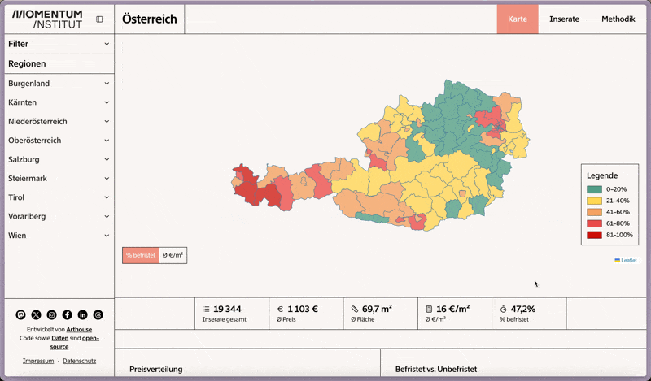

# Momentum Institut - Rental Monitor



Made by [Arthouse](https://madebyarthouse.com) in collaboration with [Momentum Institut](https://momentum-institut.at).

Application for analyzing and visualizing Austria’s rental market using data scraped from [Willhaben.at](https://www.willhaben.at). Explore trends by state and district with interactive maps, charts, and statistics.

## Stack

- **Frontend**:
  - TypeScript
  - React Router 7 (SSR)
  - Tailwind v4
  - (React) Leaflet
  - shadcn/ui w/ Radix UI + Recharts
- **Backend**:
  - Cloudflare Workers
  - Cloudflare D1 (SQLite) with Drizzle ORM

## Development

```bash
# install
pnpm install
```

```bash
# dev
pnpm dev
```

## License

AGPL v3 — see [LICENSE](LICENSE).
