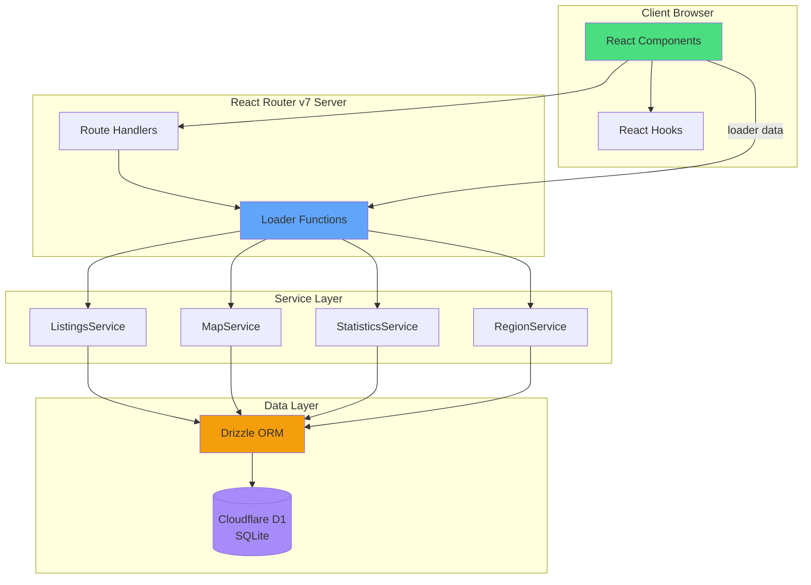
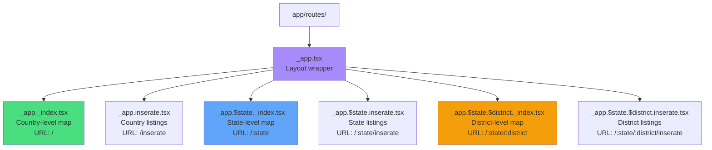
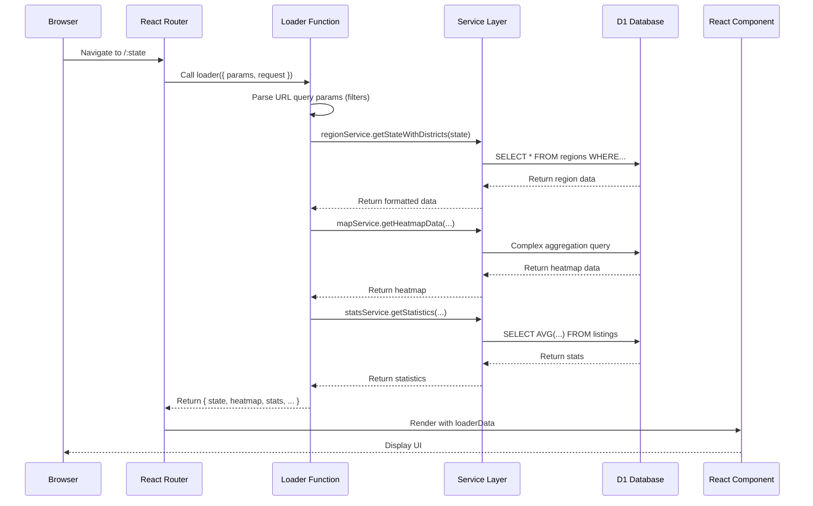

# Architecture Documentation

This document describes the frontend architecture, data loading patterns, service layer, routing structure, and features of the Rental Monitor web application.

## Table of Contents

- [System Overview](#system-overview)
- [Routing Architecture](#routing-architecture)
- [Data Loading Pattern](#data-loading-pattern)
- [Service Layer](#service-layer)

---

## System Overview

Rental Monitor is built on **React Router v7**, a full-stack React framework that combines SSR, routing, and data loading in a single architecture.

### High-Level Architecture

### Tech Stack

- **Frontend**: React 19, TypeScript, TailwindCSS v4
- **Framework**: React Router v7 (SSR + file-based routing)
- **Database**: Cloudflare D1 (SQLite)
- **ORM**: Drizzle ORM v0.44.7
- **UI Components**: Radix UI primitives
- **Charts**: Recharts
- **Maps**: React Leaflet + Leaflet.js
- **Validation**: Zod (query parameters)

---

## Routing Architecture

### File-Based Routes

React Router v7 uses file-based routing in [app/routes/](../app/routes/). Files are organized hierarchically to match URL structure.

### Route Hierarchy

### Route Structure

| URL                          | File                                 | Description                     |
| ---------------------------- | ------------------------------------ | ------------------------------- |
| `/`                          | `_app._index.tsx`                    | Country-level map with heatmap  |
| `/inserate`                  | `_app.inserate.tsx`                  | Country-level listings table    |
| `/:state`                    | `_app.$state._index.tsx`             | State-level map (e.g., `/wien`) |
| `/:state/inserate`           | `_app.$state.inserate.tsx`           | State-level listings            |
| `/:state/:district`          | `_app.$state.$district._index.tsx`   | District-level map              |
| `/:state/:district/inserate` | `_app.$state.$district.inserate.tsx` | District-level listings         |

### Layout Route (`_app.tsx`)

The `_app.tsx` layout wraps all child routes and loads shared data:

**Responsibilities**:

- Load states and districts for navigation
- Provide desktop sidebar and mobile bottom bar
- Render nested route content via `<Outlet />`

## Data Loading Pattern

React Router v7 uses **loader functions** for server-side data fetching. Loaders run on the server before rendering, providing data to components via props.

### Data Loading Flow

