# Cron Scraper Documentation

The cron scraper is a Cloudflare Worker that runs on a schedule to fetch, process, and validate rental listings from Willhaben.at. It uses a **three-cron architecture** to efficiently discover new listings, update prices, and verify listing status.

## Table of Contents

- [Overview](#overview)
- [Architecture](#architecture)
- [Three-Cron Job System](#three-cron-job-system)
  - [Discovery Run](#1-discovery-run)
  - [Sweep Run](#2-sweep-run)
  - [Verification Run](#3-verification-run)
- [Data Sources](#data-sources)
- [Data Extraction](#data-extraction)
- [Database Operations](#database-operations)
- [Run Tracking & Monitoring](#run-tracking--monitoring)
- [Configuration](#configuration)
- [Testing](#testing)
- [Deployment](#deployment)

## Overview

The scraper is located in [workers/cron-scraper/](../workers/cron-scraper/) and consists of:

- **Entry point**: [cron.scraper.ts](../workers/cron-scraper/cron.scraper.ts) - Handles scheduled events
- **Three job types**: Discovery, Sweep, and Verification
- **Data sources**: [sources/willhaben/](../workers/cron-scraper/sources/willhaben/) - HTML/JSON parsing logic
- **Utilities**: Seller upsertion, location parsing, run tracking, HTTP fetching

### Key Features

- **Scheduled execution** - Runs automatically via Cloudflare cron triggers
- **Concurrency control** - Limits parallel requests to avoid rate limiting (max 4 concurrent)
- **Resumable sweeps** - Tracks progress and resumes from last position
- **Error tracking** - Monitors run status, errors, and metrics
- **Type-safe parsing** - TypeScript interfaces for Willhaben's data structures

## Architecture

### 3-Cron Job System

```mermaid
graph TD
    subgraph "Cloudflare Scheduled Events"
        CRON1[Discovery Cron<br/>every 30 min]
        CRON2[Sweep Cron<br/>every 3 hours]
        CRON3[Verification Cron<br/>every 1 hour]
    end

    subgraph "Worker Handler"
        HANDLER[cron.scraper.ts<br/>scheduled handler]
    end

    subgraph "Job Runs"
        DISCOVERY[discovery.ts<br/>Find NEW listings]
        SWEEP[sweep.ts<br/>Update PRICES]
        VERIFICATION[verification.ts<br/>Validate STATUS]
    end

    subgraph "Data Sources"
        WILLHABEN_OVERVIEW[Willhaben Overview<br/>Search results pages]
        WILLHABEN_DETAIL[Willhaben Detail<br/>Individual listings]
    end

    subgraph "Database"
        DB[(Cloudflare D1<br/>SQLite)]
    end

    CRON1 --> HANDLER
    CRON2 --> HANDLER
    CRON3 --> HANDLER

    HANDLER -->|discovery| DISCOVERY
    HANDLER -->|sweep| SWEEP
    HANDLER -->|verification| VERIFICATION

    DISCOVERY --> WILLHABEN_OVERVIEW
    DISCOVERY --> WILLHABEN_DETAIL
    SWEEP --> WILLHABEN_OVERVIEW
    VERIFICATION --> WILLHABEN_DETAIL

    DISCOVERY --> DB
    SWEEP --> DB
    VERIFICATION --> DB

    style DISCOVERY fill:#4ade80
    style SWEEP fill:#60a5fa
    style VERIFICATION fill:#f59e0b
    style DB fill:#a78bfa
```



### Component Structure

```
workers/cron-scraper/
├── cron.scraper.ts          # Entry point (scheduled handler)
├── run-tracker.ts           # Execution tracking utility
├── runs/
│   ├── discovery.ts         # NEW listings discovery
│   ├── sweep.ts             # Price updates
│   ├── verification.ts      # Listing validation
│   └── *.test.ts            # Unit tests
├── sources/
│   └── willhaben/
│       ├── overview.ts      # Search result page parsing
│       ├── detail.ts        # Listing detail page parsing
│       ├── types/           # TypeScript interfaces
│       └── *.test.ts        # Parsing tests
├── utils/
│   ├── seller.ts            # Seller upsert logic
│   └── location-parser.ts   # Location data enhancement
├── models/
│   └── unified.ts           # Unified data model
├── lib/
│   └── http.ts              # HTTP fetch with concurrency
└── wrangler.jsonc           # Worker configuration
```

## Three-Cron Job System

### 1. Discovery Run

**Schedule**: Every 30 minutes (`*/30 * * * *`)

**Purpose**: Find NEW listings that haven't been seen before.

**Flow Diagram**:


**Key Logic**:

1. **Start from page 1** of Willhaben search results
2. **Parse each listing** from embedded JSON in HTML (`__NEXT_DATA__`)
3. **Check if new**:
   - Query database for existing `platformListingId`
   - If NEW: Insert full record + fetch detail page for seller/duration
   - If EXISTS: Update `lastSeenAt` timestamp only
4. **Track new count per page**:
   - Stop after 3 consecutive pages with 0 new listings
   - Safety limit: max 10 pages per run
5. **Record metrics**: `listingsDiscovered`, `detailPagesFetched`, `overviewPagesVisited`

**Database Operations**:

- INSERT into `listings` (new listings only)
- UPDATE `lastSeenAt` on `listings` (existing listings)
- UPSERT into `sellers` (when detail page fetched)
- INSERT into `price_history` (initial price for new listings)
- INSERT/UPDATE `scrape_runs` (tracking)

**Output**: New listings added to database with complete seller and duration information.

---

### 2. Sweep Run

**Schedule**: Every 3 hours (`0 */3 * * *`)

**Purpose**: Update PRICES on known listings and detect price changes.

**Flow Diagram**:


**Key Logic**:

1. **Resume position**:
   - If last sweep was > 12 hours ago: restart from page 1 (full sweep)
   - Otherwise: resume from `lastOverviewPage - 5` (5-page buffer for safety)
2. **For each listing on page**:
   - Check if `platformListingId` exists in database
   - If NOT in DB: skip (not yet discovered)
   - If IN DB: compare current price vs DB price
3. **On price change**:
   - Update `price` in `listings` table
   - Insert new row in `price_history` with `observedAt` timestamp
   - Increment `priceChangesDetected` counter
4. **Mark active**: Set `isActive = true` for all seen listings
5. **Update metrics**: Track `listingsUpdated`, `priceHistoryInserted`, `priceChangesDetected`

**Database Operations**:

- UPDATE `price`, `lastSeenAt`, `isActive` on `listings`
- INSERT into `price_history` (on price change)
- UPDATE `scrape_runs` (tracking)

**Output**: Up-to-date pricing data with historical tracking of price changes.

---

### 3. Verification Run

**Schedule**: Every hour (`0 * * * *`)

**Purpose**: Validate that active listings still exist (detect deactivated/removed listings).

**Flow Diagram**:

```mermaid
flowchart TD
    START([Start Verification Run])
    INIT[Initialize RunTracker<br/>type: verification]

    START --> INIT
    INIT --> QUERY[Query listings WHERE<br/>isActive = true AND<br/>lastSeenAt < 24 hours ago<br/>LIMIT 100]

    QUERY --> CHECK_COUNT{Any listings<br/>to verify?}

    CHECK_COUNT -->|No| FINISH_EMPTY[Finish run<br/>status: success<br/>listingsVerified: 0]
    CHECK_COUNT -->|Yes| FOR_EACH[For each listing]

    FOR_EACH --> FETCH_DETAIL[Fetch detail page<br/>by URL]

    FETCH_DETAIL --> PARSE_RESULT{HTTP Status}

    PARSE_RESULT -->|200 OK| FOUND[Listing still exists]
    PARSE_RESULT -->|404/Error| NOT_FOUND[Listing not found]

    FOUND --> UPDATE_VERIFIED[UPDATE listings SET<br/>verificationStatus = 'active'<br/>lastVerifiedAt = now()<br/>notFoundCount = 0]

    NOT_FOUND --> INCREMENT_NOT_FOUND[UPDATE listings SET<br/>notFoundCount += 1<br/>verificationStatus = 'not_found'<br/>isActive = false]

    UPDATE_VERIFIED --> UPDATE_METRICS1[Update run metrics<br/>listingsVerified++]
    INCREMENT_NOT_FOUND --> UPDATE_METRICS2[Update run metrics<br/>listingsNotFound++]

    UPDATE_METRICS1 --> NEXT{More listings?}
    UPDATE_METRICS2 --> NEXT

    NEXT -->|Yes| FOR_EACH
    NEXT -->|No| FINISH[Finish run<br/>status: success]

    FINISH_EMPTY --> END([End])
    FINISH --> END

    style FOUND fill:#4ade80
    style NOT_FOUND fill:#ef4444
    style INCREMENT_NOT_FOUND fill:#f59e0b
```

**Key Logic**:

1. **Query candidates**:
   - `isActive = true` (currently marked as active)
   - `lastSeenAt < NOW() - 24 hours` (not seen recently in discovery/sweep)
   - LIMIT 100 per run (avoid timeout)
2. **Fetch detail page** for each listing
3. **On success** (200 OK):
   - Mark `verificationStatus = 'active'`
   - Update `lastVerifiedAt` timestamp
   - Reset `notFoundCount = 0`
4. **On failure** (404/error):
   - Increment `notFoundCount`
   - Mark `verificationStatus = 'not_found'`
   - Set `isActive = false` (remove from active set)
5. **Update metrics**: Track `listingsVerified`, `listingsNotFound`

**Database Operations**:

- UPDATE `verificationStatus`, `lastVerifiedAt`, `notFoundCount`, `isActive` on `listings`
- UPDATE `scrape_runs` (tracking)

**Output**: Accurate `isActive` status for all listings, removing stale/deactivated entries

---

## Data Sources

### Willhaben.at Structure

Willhaben is built with **Next.js**, so all page data is embedded in a `<script id="__NEXT_DATA__">` tag as JSON.

#### Overview Pages (Search Results)

**URL Pattern**:

```
https://www.willhaben.at/iad/immobilien/mietwohnungen/mietwohnung-angebote?rows=90&page=N
```

**Data Location**:

```html
<script id="__NEXT_DATA__" type="application/json">
  {
    "props": {
      "pageProps": {
        "searchResult": {
          "advertSummaryList": {
            "advertSummary": [
              {
                "id": "123456789",
                "description": "Schöne 2-Zimmer Wohnung...",
                "attributes": {
                  "attribute": [
                    { "name": "PRICE", "values": ["850"] },
                    { "name": "ESTATE_SIZE/LIVING_AREA", "values": ["65"] },
                    { "name": "NUMBER_OF_ROOMS", "values": ["2"] }
                    // ... more attributes
                  ]
                },
                "contextLinkList": [{ "uri": "/iad/immobilien/..." }]
              }
            ]
          }
        }
      }
    }
  }
</script>
```

**Extracted Data**:

- `id` - Platform listing ID
- `description` - Title/description
- Attributes: price, area, rooms, coordinates, location details
- `uri` - Relative URL for detail page

**Parser**: [sources/willhaben/overview.ts](../workers/cron-scraper/sources/willhaben/overview.ts)

#### Detail Pages (Individual Listings)

**URL Pattern**:

```
https://www.willhaben.at/iad/immobilien/d/{slug}-{id}
```

**Data Location**:

```html
<script id="__NEXT_DATA__" type="application/json">
  {
    "props": {
      "pageProps": {
        "advert": {
          "id": "123456789",
          "attributes": {
            "attribute": [
              { "name": "ADVERT/IS_LIMITED", "values": ["true"] },
              { "name": "ADVERT/DURATION", "values": ["12"] }
              // ... location attributes
            ]
          },
          "advertiserInfo": {
            "id": "seller123",
            "label": "Wohnbaugesellschaft GmbH",
            "isPrivate": false,
            "verifiedByWillhaben": true,
            "registrationDate": "2020-01-15",
            "organisation": {
              "name": "Wohnbau GmbH",
              "phoneNumber": "+43...",
              "email": "office@...",
              "websiteUrl": "https://..."
            }
          }
        }
      }
    }
  }
</script>
```

**Extracted Data**:

- `isLimited` - Whether rental has time limit
- `durationMonths` - Number of months (if limited)
- Enhanced location data (postCode, postalName, province)
- Seller profile (ID, name, type, organization details)
- Seller stats (activeAdCount, totalAdCount)

**Parser**: [sources/willhaben/detail.ts](../workers/cron-scraper/sources/willhaben/detail.ts)

## Data Extraction

### Parsing Strategy

1. **Fetch HTML page** via HTTP GET
2. **Extract JSON**:
   ```typescript
   const match = html.match(/<script id="__NEXT_DATA__"[^>]*>(.*?)<\/script>/s);
   const json = JSON.parse(match[1]);
   ```
3. **Navigate nested structure** using TypeScript interfaces
4. **Parse attributes array**:
   ```typescript
   function getAttribute(name: string) {
     return attributes.find((a) => a.name === name)?.values[0];
   }
   ```
5. **Map to unified model** (standardized across platforms)

### Location Data Enhancement

**Vienna District Handling** ([utils/location-parser.ts](../workers/cron-scraper/utils/location-parser.ts)):

Vienna (Wien) has 23 districts with special ZIP code mapping:

- 1010 = Innere Stadt (1st district)
- 1020 = Leopoldstadt (2nd district)
- ...
- 1230 = Liesing (23rd district)

**Parsing strategies**:

1. From city field: "Wien, 7. Bezirk, Neubau" → district = "Neubau"
2. From URL slug: "wien-1070-neubauwohnung" → {state: Wien, district: Neubau, zip: 1070}
3. Bidirectional mapping: ZIP ↔ district name

### Seller Upsert Logic

**Pattern** ([utils/seller.ts](../workers/cron-scraper/utils/seller.ts)):

```typescript
async function upsertSeller(db, sellerData) {
  const existing = await db.query.sellers.findFirst({
    where: eq(sellers.platformSellerId, sellerData.platformSellerId),
  });

  if (existing) {
    await db
      .update(sellers)
      .set({
        name: sellerData.name,
        activeAdCount: sellerData.activeAdCount,
        lastSeenAt: new Date(),
        // ... update fields
      })
      .where(eq(sellers.id, existing.id));
    return existing.id;
  } else {
    const [newSeller] = await db.insert(sellers).values(sellerData).returning();
    return newSeller.id;
  }
}
```

**Strategy**:

- On discovery: minimal seller data from overview page
- On detail fetch: enrich with organization details
- On subsequent sweeps: update ad counts and lastSeenAt

## Database Operations

### Schema Overview

**7 Tables**:

1. **regions** - Geographic hierarchy (country → states → districts)
2. **listings** - Core rental listing data
3. **sellers** - Landlord/seller profiles
4. **price_history** - Temporal price tracking
5. **seller_history** - Temporal seller ad count tracking
6. **scrape_runs** - Job execution metrics
7. (Future: **images**, **amenities**, etc.)

### Key Indexes

```sql
-- Fast lookups by platform ID
CREATE UNIQUE INDEX idx_listings_platform_id ON listings(platformListingId);
CREATE INDEX idx_sellers_platform_id ON sellers(platformSellerId);

-- Query active listings
CREATE INDEX idx_listings_is_active ON listings(isActive);
CREATE INDEX idx_listings_last_seen ON listings(lastSeenAt);

-- Verification candidates
CREATE INDEX idx_listings_verification ON listings(isActive, lastSeenAt);

-- Price history temporal queries
CREATE INDEX idx_price_history_listing_observed ON price_history(listingId, observedAt);
```

### Transaction Pattern

**Example: Discovery Insert**

```typescript
await db.transaction(async (tx) => {
  // Insert listing
  const [listing] = await tx
    .insert(listings)
    .values({
      platformListingId: item.id,
      title: item.title,
      price: item.price,
      // ...
    })
    .returning();

  // Upsert seller
  const sellerId = await upsertSeller(tx, sellerData);

  // Update listing with sellerId
  await tx
    .update(listings)
    .set({ sellerId })
    .where(eq(listings.id, listing.id));

  // Insert initial price history
  await tx.insert(priceHistory).values({
    listingId: listing.id,
    price: item.price,
    observedAt: new Date(),
  });
});
```

## Run Tracking & Monitoring

### RunTracker Class

**Location**: [run-tracker.ts](../workers/cron-scraper/run-tracker.ts)

**Methods**:

```typescript
class RunTracker {
  // Start a new run
  async startRun(type: "discovery" | "sweep" | "verification"): Promise<Run>;

  // Update metrics during run
  async updateRun(runId: number, metrics: Partial<RunMetrics>): Promise<void>;

  // Finish run with status
  async finishRun(
    runId: number,
    startedAt: Date,
    status: "success" | "error",
    errorMessage?: string
  ): Promise<void>;

  // Get last run of type (for resuming)
  async getLastRunOfType(type: string): Promise<Run | undefined>;
}
```

**Metrics Tracked**:

- `overviewPagesVisited` - Number of search result pages fetched
- `detailPagesFetched` - Number of detail pages fetched
- `listingsDiscovered` - New listings added (discovery only)
- `listingsUpdated` - Existing listings updated (sweep only)
- `listingsVerified` - Listings validated as active (verification only)
- `listingsNotFound` - Listings marked inactive (verification only)
- `priceHistoryInserted` - Price history entries created
- `priceChangesDetected` - Count of price changes
- `lastOverviewPage` - Last page number visited (for sweep resume)
- `durationMs` - Total execution time
- `errorMessage` - Error details (if failed)

### Monitoring Dashboard

Query `scrape_runs` table to monitor:

- **Success rate**: `COUNT(*) WHERE status = 'success'` / `COUNT(*)`
- **Avg duration**: `AVG(durationMs)` per job type
- **Discovery rate**: `SUM(listingsDiscovered)` over time
- **Price change frequency**: `SUM(priceChangesDetected)` / `SUM(listingsUpdated)`
- **Error trends**: `COUNT(*) WHERE status = 'error'` per day

## Configuration

### Wrangler Configuration

**File**: [workers/cron-scraper/wrangler.jsonc](../workers/cron-scraper/wrangler.jsonc)

```jsonc
{
  "name": "rental-monitor-cron-scraper",
  "main": "cron.scraper.ts",
  "compatibility_date": "2024-01-01",

  // Scheduled events
  "triggers": {
    "crons": [
      "*/30 * * * *", // Discovery: every 30 min
      "0 */3 * * *", // Sweep: every 3 hours
      "0 * * * *" // Verification: every hour
    ]
  },

  // Database binding
  "d1_databases": [
    {
      "binding": "DB",
      "database_name": "rental_monitor",
      "database_id": "..."
    }
  ],

  // Resource limits
  "limits": {
    "cpu_ms": 50000 // 50 seconds max CPU time
  }
}
```

### Concurrency Control

**HTTP Fetcher** ([lib/http.ts](../workers/cron-scraper/lib/http.ts)):

```typescript
class ConcurrencyLimiter {
  private maxConcurrent = 4; // Prevent rate limiting
  private queue: Promise<any>[] = [];

  async fetch(url: string): Promise<Response> {
    while (this.queue.length >= this.maxConcurrent) {
      await Promise.race(this.queue);
    }

    const promise = fetch(url, {
      headers: {
        "User-Agent": "Mozilla/5.0 ...", // Mimic browser
      },
    });

    this.queue.push(promise);
    promise.finally(() => {
      this.queue = this.queue.filter((p) => p !== promise);
    });

    return promise;
  }
}
```

### Rate Limiting Strategy

- **Max 4 concurrent requests** to Willhaben (avoid blocking)
- **User-Agent spoofing** to appear as Chrome browser
- **Exponential backoff** on errors (retry 3x with delays)
- **Page limits**: Discovery stops after 10 pages max
- **Time limits**: Cloudflare Worker CPU limit is 50 seconds

## Testing

### Test Files

Located in [workers/cron-scraper/runs/](../workers/cron-scraper/runs/):

- [discovery.test.ts](../workers/cron-scraper/runs/discovery.test.ts) - End-to-end discovery flow
- [sweep.test.ts](../workers/cron-scraper/runs/sweep.test.ts) - Sweep logic
- [verification.test.ts](../workers/cron-scraper/runs/verification.test.ts) - Verification flow

Located in [workers/cron-scraper/sources/willhaben/](../workers/cron-scraper/sources/willhaben/):

- [overview.test.ts](../workers/cron-scraper/sources/willhaben/overview.test.ts) - HTML parsing for search results
- [detail.test.ts](../workers/cron-scraper/sources/willhaben/detail.test.ts) - HTML parsing for listing details

### Test Pattern

**Mock HTML Helper**:

```typescript
function wrapJson(data: any): string {
  return `
    <!DOCTYPE html>
    <html>
      <body>
        <script id="__NEXT_DATA__" type="application/json">
          ${JSON.stringify(data)}
        </script>
      </body>
    </html>
  `;
}
```

**Example Test**:

```typescript
import { describe, it, expect } from "vitest";
import { parseOverview } from "./overview";

describe("parseOverview", () => {
  it("should extract listing items from HTML", () => {
    const html = wrapJson({
      props: {
        pageProps: {
          searchResult: {
            advertSummaryList: {
              advertSummary: [
                {
                  id: "123456",
                  description: "Test Wohnung",
                  attributes: {
                    attribute: [
                      { name: "PRICE", values: ["850"] },
                      { name: "ESTATE_SIZE/LIVING_AREA", values: ["65"] },
                    ],
                  },
                },
              ],
            },
          },
        },
      },
    });

    const items = parseOverview(html);

    expect(items).toHaveLength(1);
    expect(items[0].price).toBe(850);
    expect(items[0].area).toBe(65);
  });
});
```

### Running Tests

```bash
# Run all scraper tests
pnpm run cron:test

# Run specific test file
pnpm run cron:test discovery

# Watch mode
pnpm run cron:test -- --watch
```

## Deployment

### Deploy Cron Worker

```bash
# Deploy to Cloudflare
pnpm run cron:deploy
```

This runs: `wrangler deploy --config workers/cron-scraper/wrangler.jsonc`

### Manual Trigger (Testing)

```bash
# Trigger discovery locally
pnpm run cron:discovery

# Trigger sweep locally
pnpm run cron:sweep

# Trigger verification locally
pnpm run cron:verification
```

**How it works**:

- Uses `wrangler dev` to run worker locally
- Simulates scheduled event with specific cron trigger
- Connects to local D1 database

### Monitoring Logs

```bash
# Tail production logs
wrangler tail rental-monitor-cron-scraper

# Filter by log level
wrangler tail rental-monitor-cron-scraper --status error
```

### Database Migrations

Before deploying, ensure migrations are applied:

```bash
# Local
pnpm run db:migrate

# Remote (production)
pnpm run db:migrate:remote
```

---

## Summary

The cron scraper efficiently monitors Willhaben.at using three specialized jobs:

1. **Discovery** (30 min) - Finds new listings with full detail
2. **Sweep** (3 hours) - Updates prices on known listings
3. **Verification** (1 hour) - Validates listing status

This architecture:

- ✅ Minimizes redundant fetching (detail pages only for new listings)
- ✅ Enables fast price updates (overview pages faster than details)
- ✅ Detects deactivated listings (verification loop)
- ✅ Resumes efficiently (sweep tracking)
- ✅ Avoids rate limiting (concurrency control)
- ✅ Provides observability (run tracking and metrics)

For questions or improvements, see the main [README](../README.md) or open an issue.
