# Frontend Architecture

**Purpose**: Detailed component architecture, layout design, and interaction patterns for desktop and mobile experiences.

**Design System**: shadcn/ui + Radix UI + Tailwind CSS
**Branding**: Momentum Institut (#E63946 primary, #457B9D secondary)

---

## Table of Contents

- [Component Overview](#component-overview)
- [Desktop Layout](#desktop-layout)
- [Sidebar Architecture](#sidebar-architecture)
- [Map View Architecture](#map-view-architecture)
- [Charts Section](#charts-section)
- [Listings View Architecture](#listings-view-architecture)
- [Mobile Layout](#mobile-layout)
- [Interaction Flows](#interaction-flows)
- [shadcn Components Reference](#shadcn-components-reference)

---

## Component Overview

### High-Level Component Hierarchy

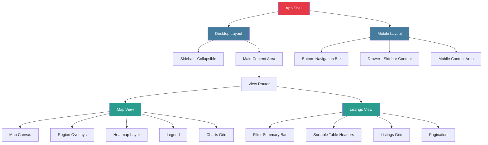

---

## Desktop Layout

### Overall Layout Structure

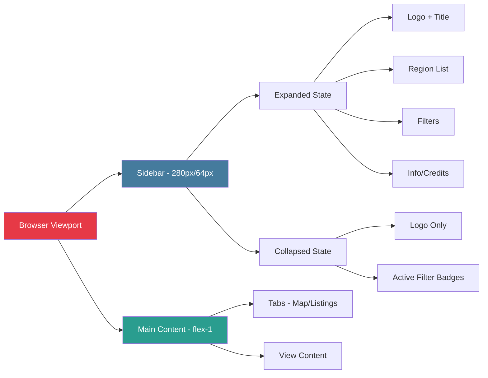

### Layout Mockup - Desktop

```
┌─────────────────────────────────────────────────────────────────┐
│                        Browser Window                            │
├──────────┬──────────────────────────────────────────────────────┤
│          │                                                       │
│  SIDEBAR │                  MAIN CONTENT                        │
│          │                                                       │
│  [280px] │                   [flex-1]                           │
│          │                                                       │
│  ┌────┐  │  ┌─────────────────────────────────────────────┐   │
│  │Logo│  │  │  Tabs: [Map] [Inserate]                     │   │
│  └────┘  │  └─────────────────────────────────────────────┘   │
│          │                                                       │
│  Regions │  ┌─────────────────────────────────────────────┐   │
│  • Wien  │  │                                              │   │
│  • Tirol │  │           MAP or LISTINGS                    │   │
│  • ...   │  │                                              │   │
│          │  │                                              │   │
│  Filters │  │                                              │   │
│  [Price] │  │                                              │   │
│  [Area]  │  │                                              │   │
│  [Limit] │  │                                              │   │
│          │  │                                              │   │
│  [═══] ← │  │                                              │   │
│  Collapse│  └─────────────────────────────────────────────┘   │
│          │                                                       │
└──────────┴──────────────────────────────────────────────────────┘
```

### Layout Mockup - Desktop Collapsed Sidebar

```
┌─────────────────────────────────────────────────────────────────┐
│                        Browser Window                            │
├────┬────────────────────────────────────────────────────────────┤
│    │                                                             │
│ S  │                  MAIN CONTENT                              │
│ B  │                                                             │
│    │                   [expanded]                               │
│ 64 │                                                             │
│ px │  ┌─────────────────────────────────────────────────┐      │
│    │  │  Tabs: [Map] [Inserate]                         │      │
│ ┌┐ │  └─────────────────────────────────────────────────┘      │
│││ │                                                             │
│└┘ │  ┌─────────────────────────────────────────────────┐      │
│    │  │ Filters: Wien • €800+ • Limited                 │      │
│ → │  └─────────────────────────────────────────────────┘      │
│Exp │                                                             │
│and │  ┌─────────────────────────────────────────────────┐      │
│    │  │                                                  │      │
│    │  │           MAP or LISTINGS                        │      │
│    │  │                                                  │      │
│    │  └─────────────────────────────────────────────────┘      │
│    │                                                             │
└────┴────────────────────────────────────────────────────────────┘
```

---

## Sidebar Architecture

### Sidebar States and Components

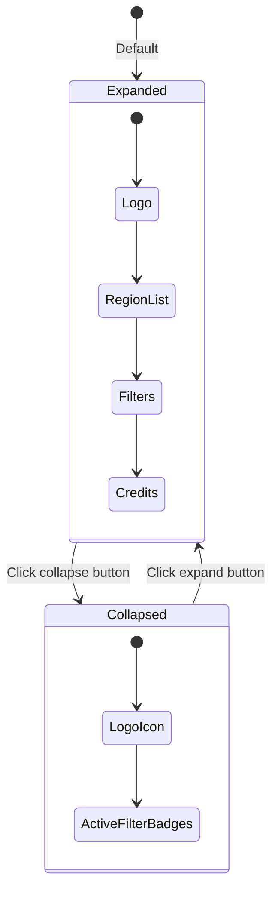

### shadcn Components for Sidebar

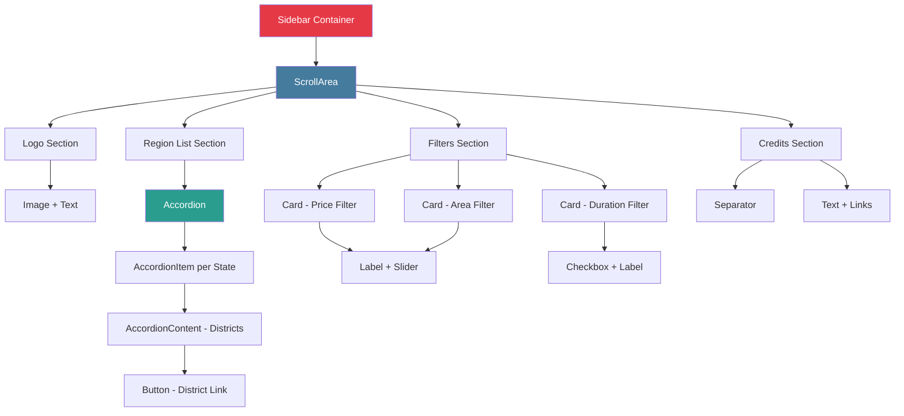

### Sidebar Component Breakdown

#### Expanded Sidebar (280px)

**Top Section**:

- **Logo + Title**: Image (48px) + "Befristungs-Monitor" text
- **Collapse Button**: Button with ChevronLeft icon (absolute positioned top-right)

**Regions Section** (ScrollArea):

- **Accordion** (shadcn) - one item per state
  - **AccordionTrigger**: State name + listing count badge
  - **AccordionContent**: List of districts
    - Each district: Button (variant="ghost") with district name + count
    - Active district: Button (variant="secondary")
    - Hover: Shows count change indicator

**Filters Section**:

- **Card** (shadcn) per filter group
  - **Price Filter**:
    - Label: "Preis"
    - Slider (shadcn) - dual range (min/max)
    - Input fields showing values
  - **Area Filter**:
    - Label: "Fläche (m²)"
    - Slider (shadcn) - dual range (min/max)
  - **Duration Filter**:
    - Label: "Befristung"
    - Checkbox: "Nur befristet"
    - Checkbox: "Nur unbefristet"
  - **Rooms Filter**:
    - Label: "Zimmer"
    - Select (shadcn) - dropdown
  - **Other Filters**:
    - Toggle buttons for furnished, balcony, etc.

**Bottom Section**:

- Separator
- Credits text (small)
- Links to About, Contact, etc.

#### Collapsed Sidebar (64px)

**Top**:

- Logo icon only (32px, centered)
- Expand button (ChevronRight icon)

**Middle**:

- Active filter badges (vertical stack)
  - Badge (shadcn) - e.g., "W" (Wien)
  - Badge - "€800+"
  - Badge - "Limited"
  - Tooltip on hover showing full filter name

**Bottom**:

- Info icon (opens popover with credits)

### Filter Update Mechanism

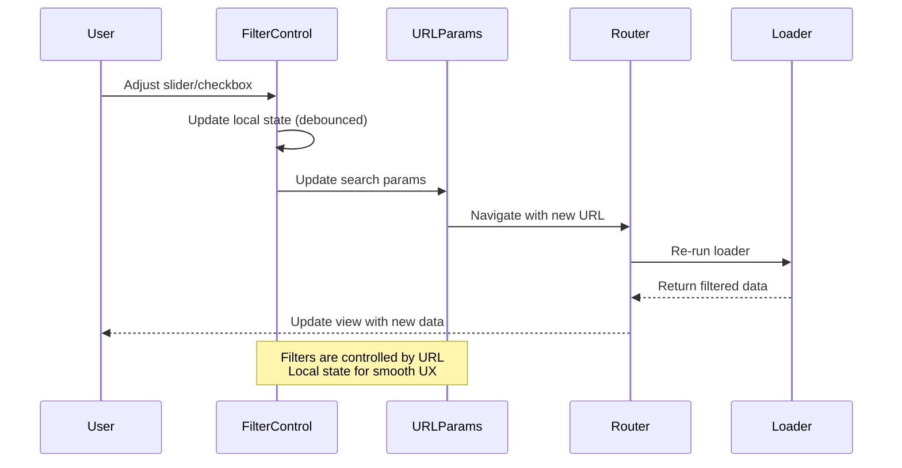

---

## Map View Architecture

### Map Components Hierarchy

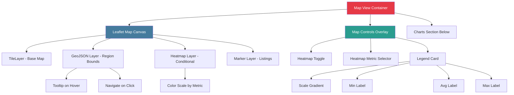

### Map View Layout Mockup

```
┌─────────────────────────────────────────────────────────────┐
│  Map View                                      [Heatmap: ON] │
├─────────────────────────────────────────────────────────────┤
│                                                               │
│                                                ┌──────────┐  │
│                                                │ Legend   │  │
│                                                │          │  │
│           LEAFLET MAP                          │ ████████ │  │
│           (Austria bounds)                     │ Min  Avg │  │
│                                                │  ↓    ↓  │  │
│           [Region polygons with                │ 450  850 │  │
│            hover tooltips]                     │     Max  │  │
│                                                │      ↓   │  │
│           [Heatmap overlay]                    │     1200 │  │
│                                                └──────────┘  │
│                                                               │
│                                                               │
├─────────────────────────────────────────────────────────────┤
│  Charts Section                                               │
├──────────────────┬──────────────────┬───────────────────────┤
│                  │                  │                        │
│  Price Chart     │  Duration Chart  │  Distribution Chart   │
│  [Recharts]      │  [Recharts]      │  [Recharts]           │
│                  │                  │                        │
│  Bar/Line        │  Pie/Donut       │  Histogram            │
│                  │                  │                        │
└──────────────────┴──────────────────┴───────────────────────┘
```

### Region Hover Tooltip Design

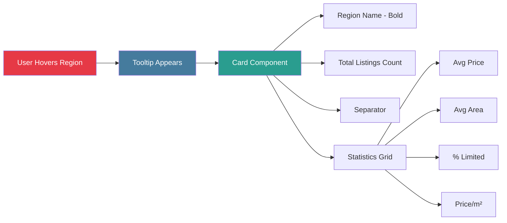

**Tooltip Content**:

```
┌────────────────────────────┐
│ Wien                        │
│ 1,234 Inserate              │
├────────────────────────────┤
│ Ø €1,250/Monat             │
│ Ø 65 m²                    │
│ 45% befristet              │
│ €19.23/m²                  │
│                            │
│ [Klicken für Details] →    │
└────────────────────────────┘
```

### Heatmap Feature

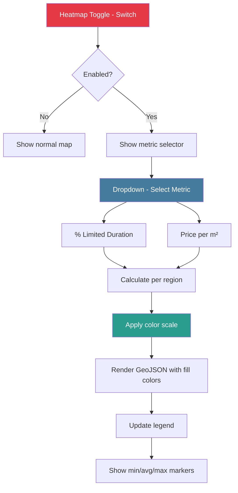

### Heatmap Legend Component

**shadcn Components**:

- Card (container)
- Badge (for min/avg/max labels)

**Layout**:

```
┌──────────────────┐
│ Heatmap Legend   │
├──────────────────┤
│                  │
│ Price per m²     │ ← Current metric
│                  │
│ ░░░░░░▓▓▓▓▓▓████ │ ← Gradient bar
│                  │
│ Min    Avg   Max │
│  ↓      ↓     ↓  │
│ €12    €18   €25 │ ← Value labels
│                  │
│ 150    450   580 │ ← Count labels
│ listings         │
│                  │
└──────────────────┘
```

### Map Controls Overlay

**Position**: Top-right of map, floating

**shadcn Components**:

- Card
- Switch
- Select
- Badge

```
┌─────────────────────┐
│ Map Controls        │
├─────────────────────┤
│ Heatmap: [ON/OFF]   │
│                     │
│ Metric: [Dropdown]  │
│ • % Limited         │
│ • Price/m²          │
│                     │
│ Legend: [✓ Show]    │
└─────────────────────┘
```

---

## Charts Section

### Charts Grid Layout

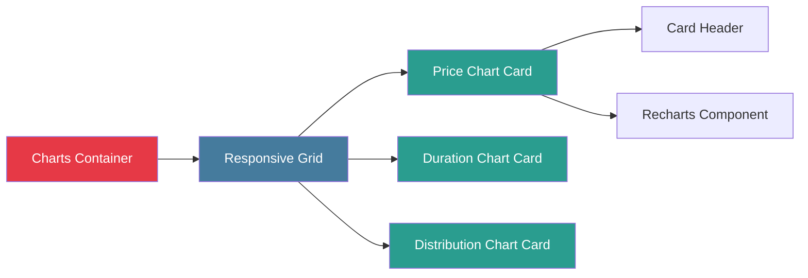

### Chart Types and Data

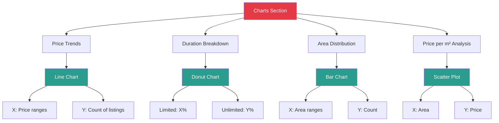

### Charts Grid Mockup

```
┌─────────────────────────────────────────────────────────────────┐
│  Statistics & Charts                                             │
├─────────────────────┬─────────────────────┬─────────────────────┤
│                     │                     │                      │
│  Price Distribution │  Duration Split     │  Area Distribution  │
│                     │                     │                      │
│  ┌───────────────┐  │  ┌───────────────┐  │  ┌───────────────┐  │
│  │               │  │  │               │  │  │               │  │
│  │  [Line Chart] │  │  │ [Donut Chart] │  │  │  [Bar Chart]  │  │
│  │               │  │  │               │  │  │               │  │
│  │  Ø €1,250     │  │  │  Limited: 45% │  │  │  Ø 65 m²      │  │
│  │  Range: €450  │  │  │  Unlim: 55%   │  │  │  Range: 20-150│  │
│  │  - €2,100     │  │  │               │  │  │               │  │
│  └───────────────┘  │  └───────────────┘  │  └───────────────┘  │
│                     │                     │                      │
└─────────────────────┴─────────────────────┴─────────────────────┘
```

### shadcn Components for Charts

**Each Chart Card**:

- Card (container)
- CardHeader (title + description)
- CardContent (chart component)
- Badge (for key metrics)

**Responsive Behavior**:

- Desktop: 3 columns (grid-cols-3)
- Tablet: 2 columns (md:grid-cols-2)
- Mobile: 1 column (grid-cols-1)

---

## Listings View Architecture

### Listings View Components

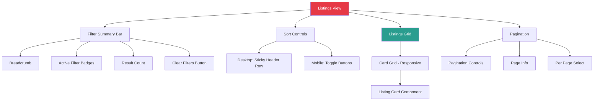

### Listings Layout Mockup - Desktop

```
┌─────────────────────────────────────────────────────────────────┐
│  Filter Summary Bar                                              │
│  Austria > Wien > Innere Stadt • €800+ • Limited • 2 Zimmer    │
│  1,234 Inserate gefunden                         [Clear Filters]│
├─────────────────────────────────────────────────────────────────┤
│  Sortable Header (Sticky)                                        │
│  [Preis ↓] [Fläche] [Datum] [Preis/m²]                         │
├──────────────┬──────────────┬──────────────┬───────────────────┤
│              │              │              │                    │
│  Card 1      │  Card 2      │  Card 3      │  Card 4           │
│              │              │              │                    │
│  Title       │  Title       │  Title       │  Title            │
│  €1,250/mo   │  €980/mo     │  €1,100/mo   │  €850/mo          │
│  65 m² • 2Z  │  48 m² • 1Z  │  72 m² • 3Z  │  55 m² • 2Z       │
│  Befristet   │  Unbefristet │  Befristet   │  Befristet        │
│  [Details]   │  [Details]   │  [Details]   │  [Details]        │
│              │              │              │                    │
├──────────────┼──────────────┼──────────────┼───────────────────┤
│              │              │              │                    │
│  Card 5      │  Card 6      │  Card 7      │  Card 8           │
│  ...         │  ...         │  ...         │  ...              │
│              │              │              │                    │
└──────────────┴──────────────┴──────────────┴───────────────────┘
│                                                                  │
│  Pagination: « 1 [2] 3 4 5 ... 52 »        Items per page: [24]│
└─────────────────────────────────────────────────────────────────┘
```

### Sortable Header Implementation

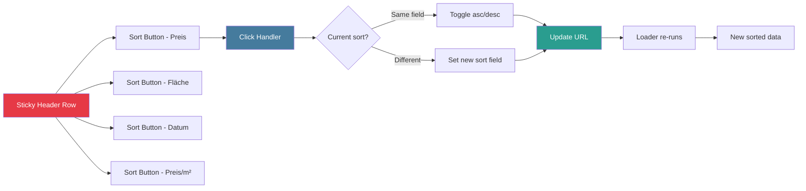

**shadcn Components**:

- Button (variant="ghost") for each sort option
- ArrowUp/ArrowDown icons for direction
- Badge to show active sort

**Header Row**:

```
┌─────────┬─────────┬─────────┬─────────────┐
│ Preis ↓ │ Fläche  │  Datum  │  Preis/m²   │
│ [active]│         │         │             │
└─────────┴─────────┴─────────┴─────────────┘
```

### Listing Card Component

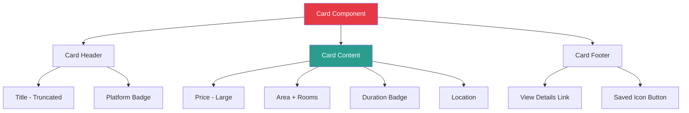

**Card Mockup**:

```
┌────────────────────────────┐
│ 2-Zimmer Wohnung in...    │ ← Title
│ [Willhaben]                │ ← Platform badge
│                            │
│ €1,250                     │ ← Price (large)
│ pro Monat                  │
│                            │
│ 65 m² • 2 Zimmer          │ ← Details
│                            │
│ [Befristet - 12 Mon.]      │ ← Duration badge
│                            │
│ Innere Stadt, Wien         │ ← Location
│                            │
├────────────────────────────┤
│ [Details ansehen] →    ♡   │ ← Footer
└────────────────────────────┘
```

### Pagination Component

**shadcn Components**:

- Pagination (shadcn built-in)
- Select (for per-page)

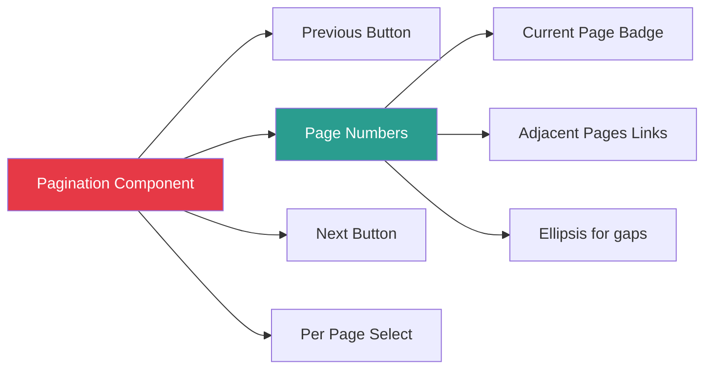

**Layout**:

```
┌────────────────────────────────────────────────────┐
│  « Previous  1  [2]  3  4  5  ...  52  Next »      │
│                                                    │
│  Showing 25-48 of 1,234 listings                   │
│  Items per page: [24 ▼]                            │
└────────────────────────────────────────────────────┘
```

---

## Mobile Layout

### Mobile Layout Overview

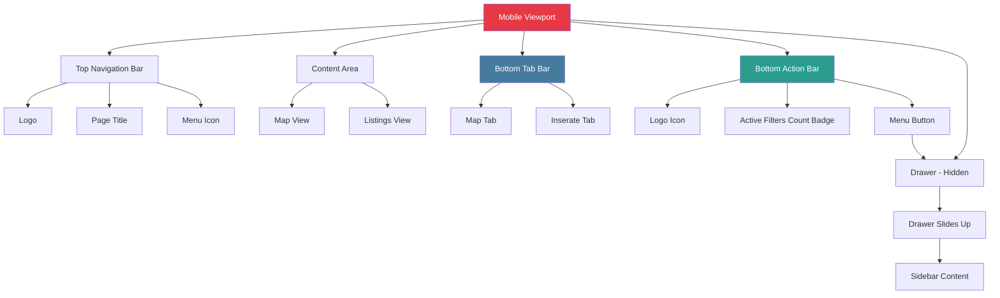

### Mobile Layout Mockup

```
┌─────────────────────────────┐
│ ┌─┐ Befristungs-Monitor  ☰  │ ← Top bar
│ └─┘                          │
├─────────────────────────────┤
│                              │
│                              │
│         CONTENT              │
│      (Map or Listings)       │
│                              │
│                              │
│                              │
│                              │
│                              │
│                              │
│                              │
├─────────────────────────────┤
│   [Karte]      [Inserate]   │ ← Tab bar
├─────────────────────────────┤
│  ┌─┐    3 Filters     ☰     │ ← Bottom bar
│  └─┘   (Active)       Menu  │   (collapsed)
└─────────────────────────────┘
```

### Mobile Drawer - Expanded

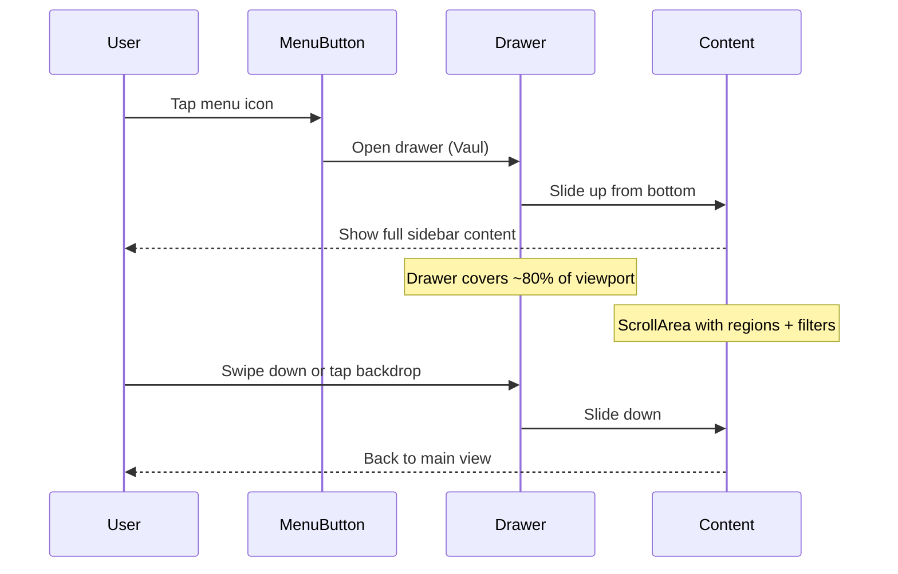

**Drawer Content Structure**:

```
┌─────────────────────────────┐
│ ───  (Drag handle)           │
│                              │
│ Filter & Navigation          │
│                              │
│ [ScrollArea starts]          │
│                              │
│ Regions:                     │
│ ▼ Wien (1,234)               │
│   • Innere Stadt (345)       │
│   • Leopoldstadt (223)       │
│   ...                        │
│                              │
│ Filters:                     │
│ ┌──────────────────────────┐ │
│ │ Preis                    │ │
│ │ Min [800] Max [2000]     │ │
│ └──────────────────────────┘ │
│                              │
│ ┌──────────────────────────┐ │
│ │ Fläche (m²)              │ │
│ │ Min [40] Max [100]       │ │
│ └──────────────────────────┘ │
│                              │
│ ☑ Nur befristet              │
│ ☐ Möbliert                   │
│                              │
│ [Apply Filters]              │
│                              │
│ [ScrollArea ends]            │
│                              │
│ ─────────────────            │
│ Credits • About • Contact    │
└─────────────────────────────┘
```

### Mobile Bottom Bar States

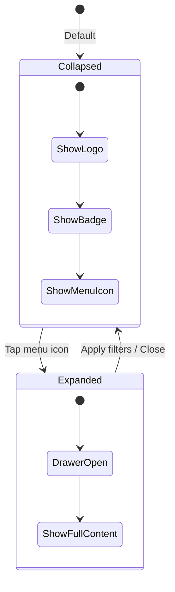

**Collapsed State** (60px height):

```
┌─────────────────────────────┐
│  ┌─┐    [3] Filters    ☰    │
│  └─┘      Active       Menu  │
│  Logo     Badge               │
└─────────────────────────────┘
```

**Expanded State** (drawer slides up):

```
┌─────────────────────────────┐
│                              │
│  ┌────────────────────────┐  │
│  │ ───  (drag handle)     │  │
│  │                        │  │
│  │  [Full sidebar content]│  │
│  │                        │  │
│  │  ...                   │  │
│  │                        │  │
│  │  [Apply]    [Cancel]   │  │
│  └────────────────────────┘  │
│                              │
│  Content (dimmed backdrop)   │
│                              │
└─────────────────────────────┘
```

### Mobile Tab Bar

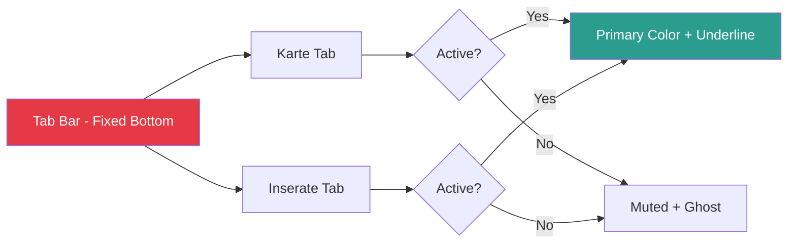

**Tab Bar Layout**:

```
┌─────────────────────────────┐
│                              │
│   [Karte]      [Inserate]    │
│   [active]     [inactive]    │
│     ━━━                      │ ← Active indicator
│                              │
└─────────────────────────────┘
```

### Mobile Listings View - Sort Controls

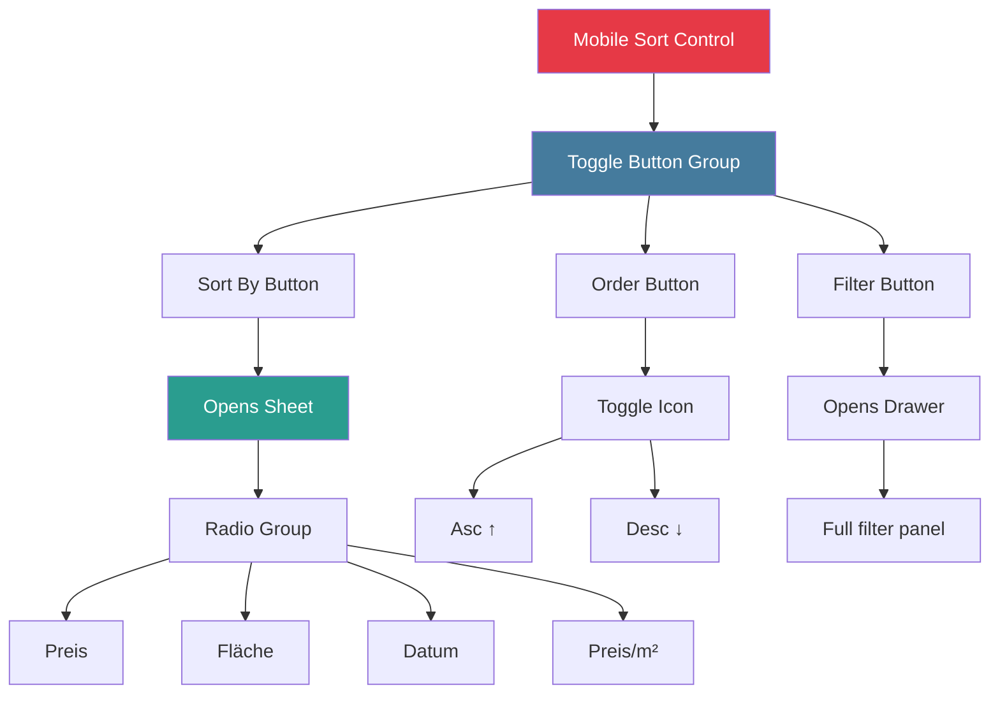

**Mobile Sort Controls Layout**:

```
┌─────────────────────────────┐
│ Sort Controls                │
├─────────────────────────────┤
│                              │
│ [Sort By: Preis ▼] [↓] [≡]  │
│  Select        Order  Filter │
│                              │
└─────────────────────────────┘
```

**Sort By Sheet** (Bottom Sheet):

```
┌─────────────────────────────┐
│ ───  Sort By                 │
│                              │
│ ◉ Preis                      │
│ ○ Fläche                     │
│ ○ Datum                      │
│ ○ Preis/m²                   │
│                              │
│ [Apply]                      │
└─────────────────────────────┘
```

### Mobile Listing Card - Compact

```
┌─────────────────────────────┐
│ Title (truncated)       [♡] │
│ €1,250/mo • 65 m² • 2Z      │
│ [Befristet]                 │
│ Innere Stadt                │
├─────────────────────────────┤
│ [Details] →                 │
└─────────────────────────────┘
```

---

## Interaction Flows

### Filter Application Flow - Desktop

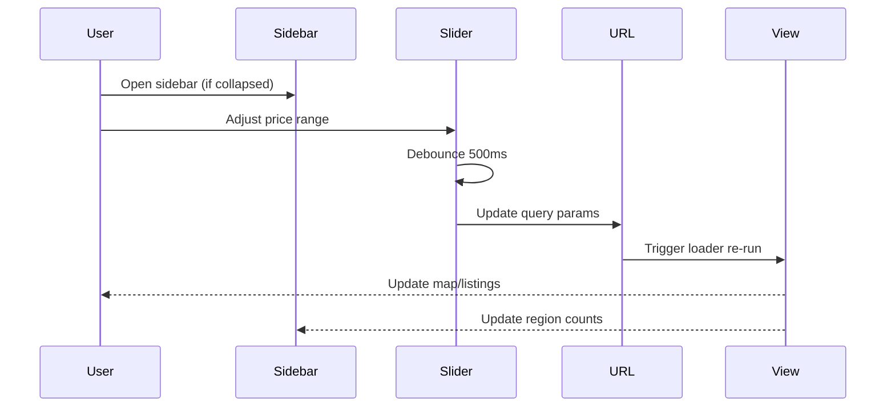

### Filter Application Flow - Mobile

```mermaid
sequenceDiagram
    participant User
    participant BottomBar
    participant Drawer
    participant Filters
    participant URL

    User->>BottomBar: Tap menu icon
    BottomBar->>Drawer: Slide up drawer
    User->>Filters: Adjust filters
    Filters->>Filters: Store in local state
    User->>Drawer: Tap "Apply Filters"
    Drawer->>URL: Update all params at once
    URL->>Drawer: Close drawer
    Drawer-->>User: Show updated view
```

### Region Navigation Flow

```mermaid
graph TD
    A[User at Austria Level] --> B{Action?}

    B -->|Click Wien in sidebar| C[Navigate to /wien]
    B -->|Click region on map| D[Navigate to /:state]
    B -->|Click district| E[Navigate to /:state/:district]

    C --> F{Preserve filters?}
    D --> F
    E --> F

    F -->|Yes| G[Append current query params]
    F -->|No| H[Navigate with clean URL]

    G --> I[Update URL]
    H --> I

    I --> J[Loader runs with new region]
    J --> K[Map recenters to region]
    J --> L[Data filtered by region]
    J --> M[Sidebar highlights active region]

    style A fill:#e63946,color:#fff
    style F fill:#457b9d,color:#fff
    style I fill:#2a9d8f,color:#fff
```

### View Switching Flow

```mermaid
graph LR
    A[Map View] --> B{User Action}
    B -->|Click Inserate Tab| C[Navigate to /inserate]
    B -->|Click region| D[Navigate to /:state]

    C --> E[Append /inserate to current URL]
    E --> F[Load listings view]
    F --> G[Preserve all filters]

    D --> H[Navigate with region]
    H --> I[Stay on map view]
    I --> J[Update map bounds]

    style A fill:#e63946,color:#fff
    style C fill:#2a9d8f,color:#fff
    style F fill:#f4a261,color:#fff
```

### Heatmap Toggle Flow

```mermaid
sequenceDiagram
    participant User
    participant Toggle
    participant MapControls
    participant MapLayer
    participant Legend

    User->>Toggle: Enable heatmap
    Toggle->>MapControls: Show metric selector
    User->>MapControls: Select "% Limited"
    MapControls->>MapLayer: Calculate colors per region
    MapLayer->>MapLayer: Apply fill colors
    MapLayer->>Legend: Calculate min/avg/max
    Legend-->>User: Display legend with markers

    Note over MapLayer: Regions colored by metric
    Note over Legend: Shows scale + data points
```

---

## shadcn Components Reference

### Complete Component List by Feature

```mermaid
mindmap
  root((shadcn/ui<br/>Components))
    Sidebar
      ScrollArea
      Accordion
      AccordionItem
      AccordionTrigger
      AccordionContent
      Button
      Card
      Slider
      Checkbox
      Select
      Label
      Separator
      Tooltip
      Popover
    Map View
      Card for Legend
      Switch for Heatmap
      Select for Metric
      Badge for Labels
      Tooltip for Regions
    Charts
      Card
      CardHeader
      CardContent
      CardTitle
      CardDescription
      Badge
    Listings
      Card
      CardHeader
      CardContent
      CardFooter
      Button
      Badge
      Pagination
      Select
      DropdownMenu
    Mobile
      Drawer Vaul
      Sheet
      Tabs
      TabsList
      TabsTrigger
      TabsContent
      RadioGroup
      RadioGroupItem
```

### Component Mapping by View

| View Section              | Components Used                                                                                                                    |
| ------------------------- | ---------------------------------------------------------------------------------------------------------------------------------- |
| **Sidebar - Expanded**    | ScrollArea, Accordion, AccordionItem, AccordionTrigger, AccordionContent, Button, Card, Slider, Checkbox, Select, Label, Separator |
| **Sidebar - Collapsed**   | Button, Badge, Tooltip, Popover                                                                                                    |
| **Map View**              | Card (legend), Switch (heatmap), Select (metric), Badge, Tooltip                                                                   |
| **Map Controls**          | Card, Switch, Select, Label                                                                                                        |
| **Charts Section**        | Card, CardHeader, CardContent, CardTitle, CardDescription, Badge                                                                   |
| **Listings - Header**     | Button (sort), Badge (active sort), Breadcrumb                                                                                     |
| **Listings - Cards**      | Card, CardHeader, CardContent, CardFooter, Button, Badge                                                                           |
| **Listings - Pagination** | Pagination, Select, Button                                                                                                         |
| **Mobile - Bottom Bar**   | Button, Badge                                                                                                                      |
| **Mobile - Drawer**       | Drawer (Vaul), ScrollArea, Button, Card, Slider, Checkbox                                                                          |
| **Mobile - Tabs**         | Tabs, TabsList, TabsTrigger, TabsContent                                                                                           |
| **Mobile - Sort**         | Sheet, RadioGroup, RadioGroupItem, Button                                                                                          |

### Responsive Breakpoints

| Breakpoint | Width   | Layout Changes                         |
| ---------- | ------- | -------------------------------------- |
| **xs**     | < 640px | Mobile layout, drawer, bottom bar      |
| **sm**     | 640px   | Mobile layout, slightly wider cards    |
| **md**     | 768px   | Transition to desktop, sidebar appears |
| **lg**     | 1024px  | Full desktop layout, 3-column charts   |
| **xl**     | 1280px  | Wider content area                     |
| **2xl**    | 1536px  | Maximum width with margins             |

---

## Visual Design Patterns

### Color Scheme

```mermaid
graph LR
    A[Momentum Branding] --> B[Primary: #E63946]
    A --> C[Secondary: #457B9D]
    A --> D[Accent: #2A9D8F]
    A --> E[Warning: #F4A261]
    A --> F[Neutral: #E9C46A]

    B --> G[CTAs, Active states]
    C --> H[Links, Secondary actions]
    D --> I[Success, Map markers]
    E --> J[Warnings, Limited badges]
    F --> K[Info, Backgrounds]

    style A fill:#e63946,color:#fff
    style B fill:#e63946,color:#fff
    style C fill:#457b9d,color:#fff
    style D fill:#2a9d8f,color:#fff
    style E fill:#f4a261,color:#000
    style F fill:#e9c46a,color:#000
```

### Typography Scale

- **Heading 1**: 2rem (32px) - Page titles
- **Heading 2**: 1.5rem (24px) - Section headers
- **Heading 3**: 1.25rem (20px) - Card titles
- **Body**: 1rem (16px) - Main text
- **Small**: 0.875rem (14px) - Helper text
- **Tiny**: 0.75rem (12px) - Badges, labels

### Spacing System

- **xs**: 0.25rem (4px)
- **sm**: 0.5rem (8px)
- **md**: 1rem (16px)
- **lg**: 1.5rem (24px)
- **xl**: 2rem (32px)
- **2xl**: 3rem (48px)

---

## Implementation Priority

```mermaid
graph TD
    A[Phase 1] --> B[Desktop Sidebar - Expanded]
    A --> C[Basic Map View]
    A --> D[Simple Listings Grid]

    E[Phase 2] --> F[Sidebar Collapse/Expand]
    E --> G[Map Heatmap Feature]
    E --> H[Charts Section]
    E --> I[Sortable Headers]

    J[Phase 3] --> K[Mobile Bottom Bar]
    J --> L[Mobile Drawer]
    J --> M[Mobile Sort Controls]
    J --> N[Responsive Refinements]

    style A fill:#e63946,color:#fff
    style E fill:#457b9d,color:#fff
    style J fill:#2a9d8f,color:#fff
```

### Component Build Order

1. **Core Layout** (Desktop first)

   - App shell with sidebar
   - Main content area with tabs
   - Route switching

2. **Sidebar** (Full featured)

   - Region accordion
   - Filter controls
   - Collapse/expand logic

3. **Map View**

   - Leaflet integration
   - Region boundaries
   - Hover tooltips
   - Navigation on click

4. **Listings View**

   - Card grid
   - Basic pagination
   - Filter summary bar

5. **Enhancements**

   - Heatmap feature
   - Charts section
   - Sortable headers
   - Advanced filters

6. **Mobile**
   - Bottom bar
   - Drawer implementation
   - Mobile-specific controls
   - Touch optimizations

---

## Next Steps

**Implementation Ready**: This architecture provides:

- Complete component hierarchy for desktop and mobile
- shadcn component mapping for every feature
- Interaction flows with sequence diagrams
- Visual mockups showing layout structure
- Responsive behavior patterns
- Clear build priority order

**Start with**: Desktop sidebar and map view, as they form the foundation for mobile adaptations.
