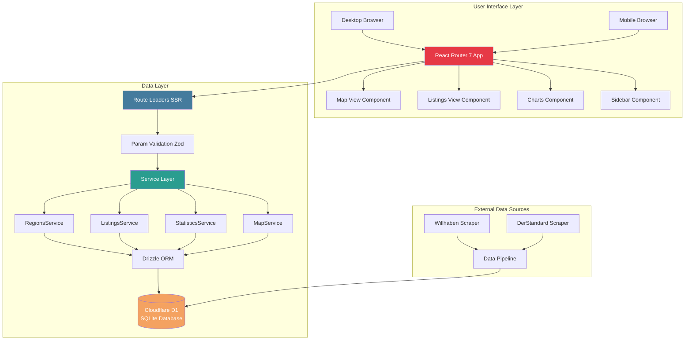
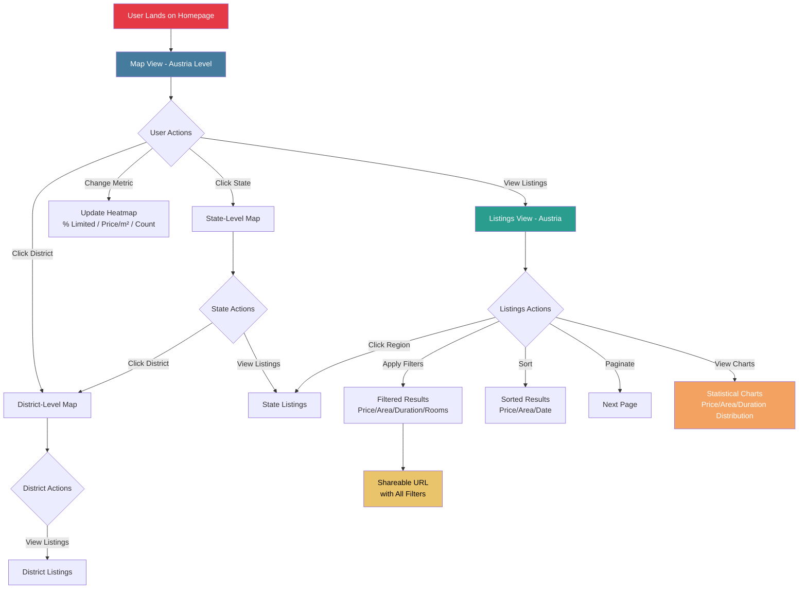
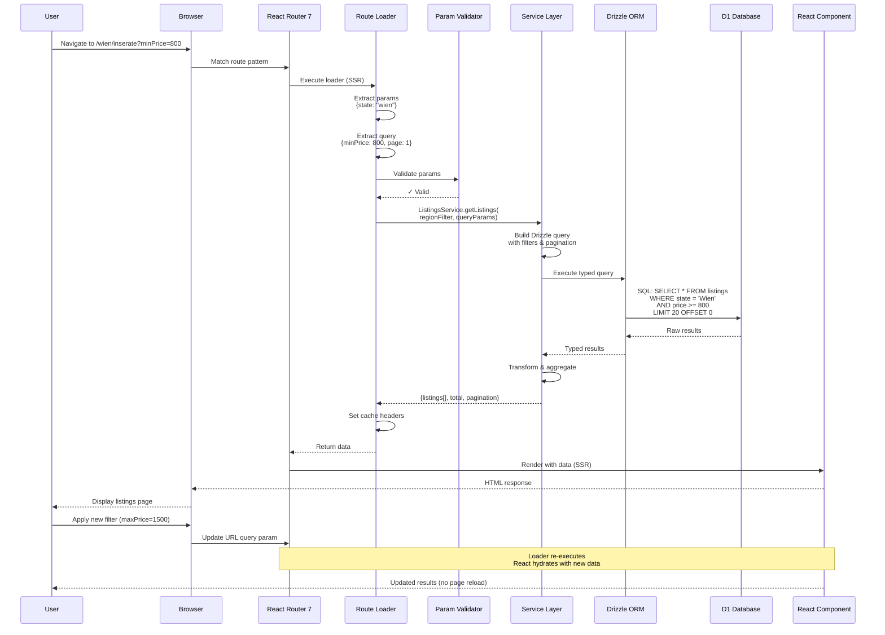

# Befristungs-Monitor: Comprehensive Product Summary

## Overview

**Befristungs-Monitor** is an Austrian rental market analytics platform built for the Momentum Institut. It aggregates rental listings from multiple sources (Willhaben, DerStandard) and provides interactive data exploration through maps, charts, and filterable listing views. The platform enables users to understand rental market trends, focusing specifically on limited-duration contracts (Befristung) across Austria's geographic hierarchy (Country → States → Districts).

## Domain & Core Concept

**Domain**: Austrian rental housing market analytics

**Geographic Hierarchy**:

- **Country Level**: Österreich (Austria)
- **State Level**: 9 Bundesländer (Wien, Tirol, Salzburg, etc.)
- **District Level**: 23 Vienna districts + major city districts

**Key Metrics Tracked**:

- Price per square meter (€/m²)
- Percentage of limited-duration contracts
- Average rental prices and areas
- Total listing counts per region
- Price distributions and trends

## Product Features

### 1. **Interactive Map View**

- Geographic visualization of Austria with region boundaries
- **Heatmap Visualization**: Color-coded regions by selected metric
  - % of limited contracts
  - Average price per m²
  - Total listing count
- Click-to-navigate: Drill down from Austria → State → District
- Hover tooltips showing region statistics
- Legend showing color scale with min/avg/max values

### 2. **Listings Explorer**

- Paginated table/grid of rental listings
- **Sortable Columns**: Price, Area, Price/m², Date posted
- **Filters**: Price range, area range, contract type, rooms, platform
- **Listing Cards**: Title, price, location, area, contract duration, platform
- External links to original listings
- Responsive cards on mobile, table on desktop

### 3. **Statistical Charts**

- **Price Distribution**: Bar chart showing price ranges
- **Area Distribution**: Bar chart showing size ranges
- **Contract Type Distribution**: Pie chart (limited vs unlimited)
- **Platform Distribution**: Pie chart showing data sources
- All charts update based on active filters and selected region

### 4. **Regional Navigation**

- Sidebar with hierarchical region list
- State-level overview with inline statistics
- Breadcrumb navigation showing current location
- Active region highlighting
- Quick stats summary (total listings, avg price, % limited)

## UI Architecture

### Desktop Layout

- **Fixed Sidebar** (320px): Logo, region list, filters, statistics
- **Main Content Area**: Tabs for Map/Listings views with full-width content
- **Collapsible Sidebar**: Reduces to 64px with icon badges for active filters
- **Charts Grid**: 2-column responsive grid below map

### Mobile Layout

- **Stacked Layout**: Top tabs, scrollable content, footer branding
- **Bottom Drawer**: Swipe-up drawer for filters and navigation
- **Tab Bar**: Switch between Karte (Map) and Inserate (Listings)
- **Compact Cards**: Mobile-optimized listing cards
- **Footer**: Momentum Institut branding with summary statistics

### Design System

- **Colors**: Primary #E63946 (red), Secondary #457B9D (blue)
- **Components**: shadcn/ui + Radix UI primitives
- **Typography**: Inter font family, 12px-30px scale
- **Responsive Breakpoints**: Mobile (<768px), Desktop (≥768px)

## Technical Architecture

### Routing Strategy

**React Router 7** with URL-driven state (no client-side state management):

**Routes** (3 files total):

1. `/_app.tsx` - Layout with sidebar
2. `/_app._index.tsx` - Map view (handles `/`, `/:state`, `/:state/:district`)
3. `/_app.inserate.tsx` - Listings view (handles `/inserate`, `/:state/inserate`, etc.)

**URL Pattern Examples**:

- `/` - Austria map view
- `/wien` - Vienna state map view
- `/wien/innere-stadt` - Innere Stadt district map
- `/wien/inserate?minPrice=800&limited=true&page=2` - Filtered Vienna listings

### Rendering Strategy

- **Server-Side Rendering (SSR)**: React Router 7 loaders fetch data on server
- **Single Fetch**: All data loaded in loader before page renders
- **Progressive Enhancement**: Works without JavaScript
- **URL as State**: All filters, pagination, sorting in URL query params

### Data Flow

**Service Layer Pattern**:

```
Route Loader → Validate Params (Zod) → Service Layer → Drizzle ORM → Database
```

**Four Core Services**:

1. **RegionsService**: Region metadata, hierarchies, validation
2. **ListingsService**: Filtered listings queries with pagination
3. **StatisticsService**: Aggregated stats for charts
4. **MapService**: Lightweight marker data with coordinates

**Data Storage**:

- **Primary**: Cloudflare D1 (SQLite)
- **Local Dev**: SQLite with Drizzle ORM
- **Tables**: `regions`, `listings`, (future: `sellers`, `priceHistory`, `scrapingSessions`)

## Mermaid Diagrams

### Diagram 1: Overall System Architecture



### Diagram 2: Feature Map & User Journey



### Diagram 3: Data Flow & Rendering Pipeline



## Summary

Befristungs-Monitor is a **geo-spatial analytics platform** for Austrian rental listings that prioritizes:

1. **Simplicity**: 3 route files handle all views via URL-driven state
2. **Performance**: SSR with single data fetch, efficient SQL queries
3. **Discoverability**: Interactive map-based exploration with drill-down navigation
4. **Transparency**: Visual statistics and charts showing market trends
5. **Shareability**: Every filter state is a shareable URL
6. **Accessibility**: Server-rendered, works without JS, keyboard navigable

The 7-day MVP focuses on a polished user experience with clean data visualization, while Phase 2 adds production scraping infrastructure and admin tools. Built entirely on web platform standards (React Router 7, URL state, forms) without additional state management complexity.
