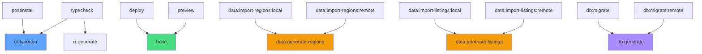

# Package Scripts Guide

This document explains all available npm/pnpm scripts in [package.json](../package.json). Scripts are organized by category for easy reference.

## Table of Contents

- [Development](#development)
- [Building & Deployment](#building--deployment)
- [Database Management](#database-management)
- [Data Import & Generation](#data-import--generation)
- [Cron Scraper](#cron-scraper)
- [Testing](#testing)
- [Type Generation](#type-generation)

---

## Development

### `pnpm run dev`

Start the React Router development server with Hot Module Replacement (HMR).

```bash
pnpm run dev
```

**What it does**:
- Starts dev server on `http://localhost:5173`
- Enables HMR for instant updates
- Connects to local D1 database
- Server-side rendering with React Router v7

**Use when**: Developing the web application locally.

---

### `pnpm run preview`

Build the app and preview the production build locally.

```bash
pnpm run preview
```

**What it does**:
1. Runs `pnpm run build` to create production bundle
2. Starts Vite preview server to serve the built app

**Use when**: Testing production build before deployment.

---

### `pnpm run typecheck`

Run TypeScript type checking across the entire project.

```bash
pnpm run typecheck
```

**What it does**:
1. Generates Cloudflare types (`cf-typegen`)
2. Generates React Router types (`react-router typegen`)
3. Runs TypeScript compiler in build mode (`tsc -b`)

**Use when**: Before committing changes to ensure type safety.

**Exit codes**:
- `0` - No type errors
- `1` - Type errors found (fix before deploying)

---

## Building & Deployment

### `pnpm run build`

Build the application for production.

```bash
pnpm run build
```

**What it does**:
- Compiles React Router app for production
- Bundles client and server code
- Optimizes assets (minification, tree-shaking)
- Outputs to `build/` directory

**Output**:
- `build/client/` - Static assets
- `build/server/` - Server-side code for Cloudflare Workers

**Use when**: Preparing for deployment.

---

### `pnpm run deploy`

Build and deploy the web application to Cloudflare.

```bash
pnpm run deploy
```

**What it does**:
1. Runs `pnpm run build`
2. Deploys to Cloudflare Pages/Workers using Wrangler

**Requirements**:
- Must be logged in to Wrangler (`wrangler login`)
- Cloudflare account configured

**Use when**: Deploying changes to production.

---

## Database Management

### `pnpm run db:generate`

Generate database migrations from schema changes.

```bash
pnpm run db:generate
```

**What it does**:
- Reads [app/db/schema.ts](../app/db/schema.ts)
- Compares with current database state
- Generates SQL migration files in [drizzle/](../drizzle/) directory

**Example output**:
```
drizzle/0001_add_verification_status.sql
```

**Use when**: After modifying database schema in `app/db/schema.ts`.

**Next step**: Run `db:migrate` to apply the generated migration.

---

### `pnpm run db:migrate`

Apply database migrations to local D1 database.

```bash
pnpm run db:migrate
```

**What it does**:
- Applies all pending migrations in [drizzle/](../drizzle/) to local database
- Updates `.wrangler/state/v3/d1/miniflare-D1DatabaseObject/*.sqlite`

**Use when**:
- After running `db:generate`
- Setting up local database for the first time
- Pulling latest schema changes from git

---

### `pnpm run db:migrate:remote`

Apply database migrations to remote (production) D1 database.

```bash
pnpm run db:migrate:remote
```

**What it does**:
- Applies all pending migrations to Cloudflare D1 production database
- Irreversible operation (be careful!)

**Use when**: Deploying schema changes to production.

**Warning**: Always test migrations locally first!

---

### `pnpm run db:studio`

Open Drizzle Studio to browse/edit local database.

```bash
pnpm run db:studio
```

**What it does**:
- Starts Drizzle Studio web UI on `https://local.drizzle.studio`
- Connects to local D1 database
- Provides GUI for browsing tables, running queries, editing data

**Use when**:
- Inspecting database contents
- Debugging data issues
- Manual data entry/editing

**Screenshot**:
```
┌────────────┬────────────┬─────────┬──────────┐
│ id         │ title      │ price   │ area     │
├────────────┼────────────┼─────────┼──────────┤
│ 1          │ Wohnung... │ 850.00  │ 65.0     │
└────────────┴────────────┴─────────┴──────────┘
```

---

### `pnpm run db:studio:remote`

Open Drizzle Studio connected to remote (production) database.

```bash
pnpm run db:studio:remote
```

**What it does**:
- Sets `NODE_ENV=production`
- Connects to Cloudflare D1 production database
- Opens Drizzle Studio web UI

**Use when**: Inspecting production data (read-only recommended).

**Warning**: Be cautious editing production data!

---

### `pnpm run db:import:remote-to-local`

Copy remote (production) database to local environment.

```bash
pnpm run db:import:remote-to-local
```

**What it does**:
1. Exports remote D1 database to SQL dump
2. Imports dump into local SQLite database
3. Overwrites local database (backup first if needed!)

**Use when**:
- Testing with production data locally
- Debugging production issues
- Seeding local dev environment

**Script location**: [app/scripts/db-import-remote-to-local.ts](../app/scripts/db-import-remote-to-local.ts)

---

### `pnpm run db:import:local-to-remote`

Copy local database to remote (production) environment.

```bash
pnpm run db:import:local-to-remote
```

**What it does**:
1. Exports local SQLite database to SQL dump
2. Imports dump into Cloudflare D1 production database
3. **Overwrites production database!**

**Use when**:
- Initial deployment with seed data
- Restoring production from backup

**⚠️ WARNING**: This overwrites production data! Use with extreme caution.

**Script location**: [app/scripts/db-import-local-to-remote.ts](../app/scripts/db-import-local-to-remote.ts)

---

## Data Import & Generation

### `pnpm run data:generate-regions-json`

Generate Austrian regions data as JSON.

```bash
pnpm run data:generate-regions-json
```

**What it does**:
- Generates JSON file with Austrian states and districts
- Includes GeoJSON boundaries, coordinates, hierarchy
- Outputs to [app/scripts/data/regions.json](../app/scripts/data/regions.json)

**Data structure**:
```json
{
  "country": {
    "name": "Austria",
    "slug": "austria",
    "type": "country"
  },
  "states": [
    {
      "name": "Wien",
      "slug": "wien",
      "type": "state",
      "districts": [...]
    }
  ]
}
```

**Use when**: Updating region boundary data.

---

### `pnpm run data:generate-regions`

Generate SQL INSERT statements for regions table.

```bash
pnpm run data:generate-regions
```

**What it does**:
- Generates SQL file with INSERT statements for regions
- Outputs to [app/scripts/data/regions.sql](../app/scripts/data/regions.sql)

**Example output**:
```sql
INSERT INTO regions (name, slug, type, parentId, centerLat, centerLng, geojson)
VALUES ('Wien', 'wien', 'state', 1, 48.2082, 16.3738, '{"type":"Polygon",...}');
```

**Use when**: Preparing to import region data to database.

---

### `pnpm run data:import-regions:local`

Import Austrian region data into local database.

```bash
pnpm run data:import-regions:local
```

**What it does**:
1. Runs `data:generate-regions` to create SQL file
2. Executes SQL file against local D1 database
3. Populates `regions` table with Austria's states and districts

**Use when**:
- First-time local database setup
- Resetting region data

**Data imported**:
- 1 country (Austria)
- 9 states (Wien, Niederösterreich, etc.)
- ~100 districts

---

### `pnpm run data:import-regions:remote`

Import Austrian region data into remote (production) database.

```bash
pnpm run data:import-regions:remote
```

**What it does**:
1. Runs `data:generate-regions` to create SQL file
2. Executes SQL file against remote D1 database

**Use when**: First-time production setup or updating region boundaries.

---

### `pnpm run data:generate-listings`

Generate fake listings data for testing (SQL).

```bash
pnpm run data:generate-listings
```

**What it does**:
- Generates realistic test listings data
- Creates INSERT statements for `listings`, `sellers`, `price_history`
- Outputs to [app/scripts/data/listings.sql](../app/scripts/data/listings.sql)

**Use when**: Need test data for development without running scraper.

---

### `pnpm run data:import-listings:local`

Import fake listings data into local database.

```bash
pnpm run data:import-listings:local
```

**What it does**:
1. Runs `data:generate-listings`
2. Executes SQL file against local database
3. Populates database with test listings

**Use when**:
- Testing UI with realistic data
- Development without waiting for scraper
- Demos

---

### `pnpm run data:import-listings:remote`

Import fake listings data into remote database.

```bash
pnpm run data:import-listings:remote
```

**What it does**: Same as local, but targets production database.

**Use when**: Seeding production with initial data (use with caution).

---

## Cron Scraper

### `pnpm run cron:deploy`

Deploy cron scraper worker to Cloudflare.

```bash
pnpm run cron:deploy
```

**What it does**:
- Deploys [workers/cron-scraper/](../workers/cron-scraper/) to Cloudflare Workers
- Registers scheduled cron triggers
- Links to D1 database binding

**Configuration**: [workers/cron-scraper/wrangler.jsonc](../workers/cron-scraper/wrangler.jsonc)

**Use when**: Deploying scraper changes to production.

---

### `pnpm run cron:dev`

Start cron scraper worker in local development mode.

```bash
pnpm run cron:dev
```

**What it does**:
- Starts Wrangler dev server on `http://localhost:8787`
- Connects to local D1 database
- Enables manual cron trigger via HTTP

**Use when**:
- Developing scraper logic
- Testing cron jobs locally

**Next step**: Use `cron:discovery`, `cron:sweep`, or `cron:verification` to trigger jobs.

---

### `pnpm run cron:discovery`

Manually trigger discovery cron job (local).

```bash
# First, start the dev server in another terminal:
pnpm run cron:dev

# Then trigger discovery:
pnpm run cron:discovery
```

**What it does**:
- Sends HTTP request to local worker with discovery cron schedule
- Triggers discovery run (finds NEW listings on Willhaben)

**Cron schedule**: `*/30 * * * *` (every 30 minutes in production)

**Use when**: Testing discovery logic locally.

---

### `pnpm run cron:sweep`

Manually trigger sweep cron job (local).

```bash
# First, start the dev server:
pnpm run cron:dev

# Then trigger sweep:
pnpm run cron:sweep
```

**What it does**:
- Sends HTTP request to local worker with sweep cron schedule
- Triggers sweep run (updates PRICES on known listings)

**Cron schedule**: `0 */3 * * *` (every 3 hours in production)

**Use when**: Testing sweep logic locally.

---

### `pnpm run cron:verification`

Manually trigger verification cron job (local).

```bash
# First, start the dev server:
pnpm run cron:dev

# Then trigger verification:
pnpm run cron:verification
```

**What it does**:
- Sends HTTP request to local worker with verification cron schedule
- Triggers verification run (validates listing STATUS)

**Cron schedule**: `0 */6 * * *` (every 6 hours in package.json, but every hour in production config)

**Use when**: Testing verification logic locally.

---

### `pnpm run cron:test`

Run all cron scraper tests.

```bash
pnpm run cron:test
```

**What it does**:
- Runs Vitest on all test files in [workers/cron-scraper/](../workers/cron-scraper/)
- Tests parsing logic, run logic, and utilities

**Test files**:
- `sources/willhaben/overview.test.ts` - Overview page parsing
- `sources/willhaben/detail.test.ts` - Detail page parsing
- `runs/discovery.test.ts` - Discovery run logic
- `runs/sweep.test.ts` - Sweep run logic
- `runs/verification.test.ts` - Verification run logic

**Use when**:
- Before committing scraper changes
- After modifying Willhaben parsing logic

---

### `pnpm run cron:test:discovery`

Run only discovery/overview parsing tests.

```bash
pnpm run cron:test:discovery
```

**What it does**: Runs [workers/cron-scraper/sources/willhaben/overview.test.ts](../workers/cron-scraper/sources/willhaben/overview.test.ts)

**Use when**: Testing overview page parsing changes.

---

### `pnpm run cron:test:sweep`

Run only sweep tests.

```bash
pnpm run cron:test:sweep
```

**What it does**: Runs [workers/cron-scraper/runs/sweep.test.ts](../workers/cron-scraper/runs/sweep.test.ts)

**Use when**: Testing sweep logic changes.

---

### `pnpm run cron:test:verification`

Run only verification/detail parsing tests.

```bash
pnpm run cron:test:verification
```

**What it does**: Runs [workers/cron-scraper/sources/willhaben/detail.test.ts](../workers/cron-scraper/sources/willhaben/detail.test.ts)

**Use when**: Testing detail page parsing changes.

---

### `pnpm run cron:db:migrate:local`

Apply database migrations for cron worker (local).

```bash
pnpm run cron:db:migrate:local
```

**What it does**:
- Applies migrations to local database using cron worker's Wrangler config
- Ensures cron worker can access schema changes

**Use when**: After schema changes, before testing cron locally.

---

### `pnpm run cron:db:copy-local`

Copy local database to cron worker's directory.

```bash
pnpm run cron:db:copy-local
```

**What it does**:
- Copies `.wrangler/state/v3/d1/miniflare-D1DatabaseObject/*.sqlite`
- To `workers/cron-scraper/.wrangler/state/v3/d1/miniflare-D1DatabaseObject/`
- Ensures both workers share same local database

**Use when**:
- Cron worker can't find local database
- After importing data to main app

---

## Type Generation

### `pnpm run cf-typegen`

Generate TypeScript types for Cloudflare bindings.

```bash
pnpm run cf-typegen
```

**What it does**:
- Reads `wrangler.toml` configuration
- Generates types for D1 database bindings, KV namespaces, etc.
- Outputs to `worker-configuration.d.ts`

**Generated types**:
```typescript
interface Env {
  DB: D1Database;
}
```

**Use when**:
- After modifying `wrangler.toml`
- Automatically runs on `postinstall`

---

### `pnpm run rr:generate`

Generate React Router types.

```bash
pnpm run rr:generate
```

**What it does**:
- Scans [app/routes/](../app/routes/) for route files
- Generates type-safe route types
- Outputs to `.react-router/types/`

**Generated types**:
- Type-safe route paths
- Loader data types
- Action data types

**Use when**:
- After adding/modifying routes
- Getting type errors in route modules

---

### `pnpm run postinstall`

Runs automatically after `pnpm install`.

```bash
# Automatically runs after:
pnpm install
```

**What it does**: Runs `cf-typegen` to generate Cloudflare types.

**Use when**: Never manually - runs automatically.

---

## Common Workflows

### First-Time Setup

```bash
# 1. Install dependencies
pnpm install

# 2. Generate and apply migrations
pnpm run db:generate
pnpm run db:migrate

# 3. Import region data
pnpm run data:import-regions:local

# 4. (Optional) Import test listings
pnpm run data:import-listings:local

# 5. Start dev server
pnpm run dev
```

---

### Local Development with Scraper

```bash
# Terminal 1: Main app
pnpm run dev

# Terminal 2: Cron worker
pnpm run cron:dev

# Terminal 3: Trigger jobs
pnpm run cron:discovery
pnpm run cron:sweep
pnpm run cron:verification
```

---

### Deploy to Production

```bash
# 1. Apply migrations to remote database
pnpm run db:migrate:remote

# 2. Import region data (first time only)
pnpm run data:import-regions:remote

# 3. Deploy main app
pnpm run deploy

# 4. Deploy cron scraper
pnpm run cron:deploy
```

---

### Schema Changes Workflow

```bash
# 1. Edit schema
# Edit app/db/schema.ts

# 2. Generate migration
pnpm run db:generate

# 3. Review generated SQL
# Check drizzle/XXXX_migration.sql

# 4. Apply locally
pnpm run db:migrate

# 5. Test changes
pnpm run dev

# 6. Apply to production
pnpm run db:migrate:remote

# 7. Deploy app
pnpm run deploy
```

---

### Debugging Production Issues

```bash
# 1. Copy production database locally
pnpm run db:import:remote-to-local

# 2. Inspect data
pnpm run db:studio

# 3. Test with production data
pnpm run dev
```

---

## Script Dependencies

Some scripts depend on others running first:



---

## Troubleshooting

### "Database not found" error

**Solution**:
```bash
pnpm run db:migrate
# or
pnpm run cron:db:copy-local
```

---

### Cron trigger not working locally

**Solution**:
1. Ensure `pnpm run cron:dev` is running
2. Check the port is 8787
3. Try URL-encoded cron triggers:
   ```bash
   curl "http://localhost:8787/__scheduled?cron=%2A%2F30+%2A+%2A+%2A+%2A"
   ```

---

### Type errors after schema changes

**Solution**:
```bash
pnpm run typecheck
# If still issues:
rm -rf .react-router node_modules/.vite
pnpm install
```

---

### Migrations out of sync

**Solution**:
```bash
# Reset local database
rm -rf .wrangler/state
pnpm run db:migrate

# Re-import data
pnpm run data:import-regions:local
```

---

## Summary

This project uses 38 npm scripts organized into 7 categories:

| Category | Scripts | Purpose |
|----------|---------|---------|
| **Development** | 3 | Dev server, preview, typecheck |
| **Build & Deploy** | 2 | Build and deploy app |
| **Database** | 7 | Migrations, Studio, import/export |
| **Data Generation** | 6 | Region and listing data |
| **Cron Scraper** | 10 | Deploy, test, trigger jobs |
| **Testing** | 4 | Run scraper tests |
| **Type Generation** | 3 | Cloudflare and React Router types |

For more details on the scraper architecture, see [CRON-SCRAPER.md](./CRON-SCRAPER.md).

For architecture and data flow, see [ARCHITECTURE.md](./ARCHITECTURE.md).
