# Routing Architecture V2

**Purpose**: Define the simplified routing structure with consolidated routes, flexible service layer, and clear separation of concerns.

**Philosophy**: Thin route files that handle params, errors, and headers. Business logic in services. Presentation logic in React components.

---

## Table of Contents

- [Overview](#overview)
- [Route Structure](#route-structure)
- [File Organization](#file-organization)
- [Service Layer Architecture](#service-layer-architecture)
- [Route Responsibilities](#route-responsibilities)
- [Data Flow](#data-flow)
- [Product Architecture](#product-architecture)

---

## Overview

### Key Simplification

**Before**: 7 route files (1 layout + 6 routes for Austria/State/District × Map/Listings)

**After**: 3 route files (1 layout + 2 views that handle all geographic levels)

### How It Works

Routes use optional path parameters to handle all geographic levels in a single file:

- Map view route handles: `/`, `/:state`, `/:state/:district`
- Listings view route handles: `/inserate`, `/:state/inserate`, `/:state/:district/inserate`
- Services receive region parameters and adapt their queries accordingly

---

## Route Structure

### Routes Configuration

React Router 7 uses a `routes.ts` file for programmatic route definition:

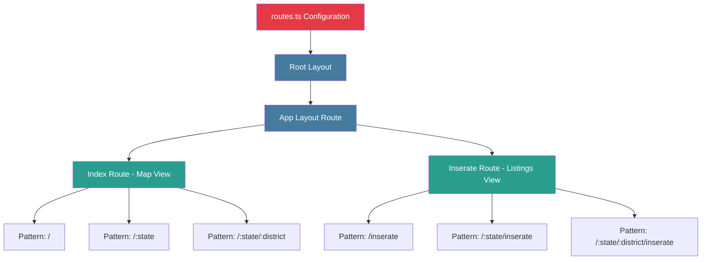

### URL Patterns

| View     | Geographic Level | URL Pattern                  | Example                       |
| -------- | ---------------- | ---------------------------- | ----------------------------- |
| Map      | Austria          | `/`                          | `/`                           |
| Map      | State            | `/:state`                    | `/wien`                       |
| Map      | District         | `/:state/:district`          | `/wien/innere-stadt`          |
| Listings | Austria          | `/inserate`                  | `/inserate`                   |
| Listings | State            | `/:state/inserate`           | `/wien/inserate`              |
| Listings | District         | `/:state/:district/inserate` | `/wien/innere-stadt/inserate` |

All URLs accept query parameters: `?page=2&minPrice=800&limited=true&sortBy=price&...`

---

## File Organization

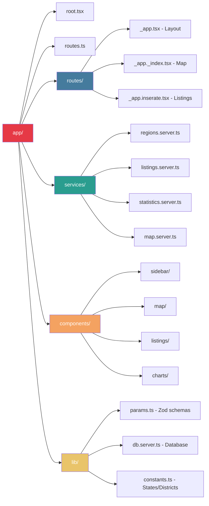

### File Structure

**Routes** (3 files):

- `app/root.tsx` - Root HTML, styles, error boundary
- `app/routes/_app.tsx` - Layout with sidebar loader
- `app/routes/_app._index.tsx` - Map view (handles all geographic levels)
- `app/routes/_app.inserate.tsx` - Listings view (handles all geographic levels)

**Services** (4 files):

- `app/services/regions.server.ts` - Region metadata and stats
- `app/services/listings.server.ts` - Listing queries with filtering
- `app/services/statistics.server.ts` - Aggregated statistics for charts
- `app/services/map.server.ts` - Map marker data with bounds

**Components** (organized by domain):

- `app/components/sidebar/` - Sidebar, region list, stats
- `app/components/map/` - Map, markers, legend
- `app/components/listings/` - Grid, cards, pagination
- `app/components/charts/` - Price, distribution, trend charts

**Lib** (shared utilities):

- `app/lib/params.ts` - Zod schemas for validation
- `app/lib/db.server.ts` - Database client configuration
- `app/lib/constants.ts` - Austrian states and districts

---

## Service Layer Architecture

### Design Principles

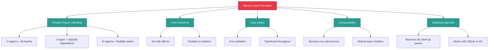

### Service Function Signature Pattern

All service functions follow this pattern:

- **Input**: Database client + Region filter (optional) + Query params (filters, pagination, sorting)
- **Output**: Type-safe data structures
- **Responsibility**: Build Drizzle queries, execute, transform results

### Region Filter Flexibility

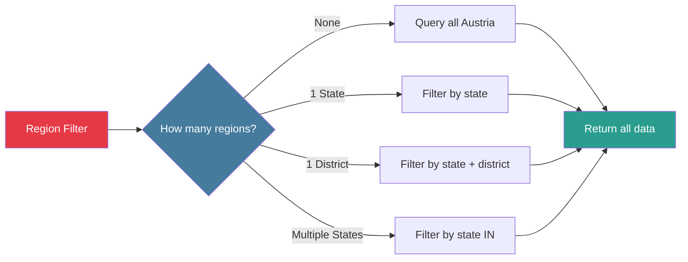

### Four Core Services

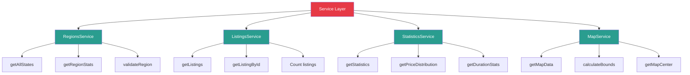

#### 1. RegionsService

**Purpose**: Provide region metadata for sidebar and validation

**Functions**:

- `getAllStates()` - Returns all Austrian states with listing counts
- `getRegionStats(filter)` - Returns statistics for specified region(s)
- `validateRegion(state, district)` - Checks if region exists, throws 404 if not

**Used By**: App layout loader, all route loaders for validation

#### 2. ListingsService

**Purpose**: Fetch and filter rental listings

**Functions**:

- `getListings(regionFilter, queryParams)` - Paginated listings with filters
- `getListingById(id)` - Single listing detail
- `countListings(regionFilter, queryParams)` - Total count for pagination

**Region Handling**:

- No filter: Query all listings
- State filter: `WHERE state = ?`
- District filter: `WHERE state = ? AND district = ?`
- Multiple states: `WHERE state IN (?)`

**Query Params Handled**:

- Pagination: `page`, `perPage`
- Sorting: `sortBy`, `order`
- Filters: `minPrice`, `maxPrice`, `minArea`, `maxArea`, `limited`, `unlimited`, `rooms`, `furnished`, `search`

#### 3. StatisticsService

**Purpose**: Generate aggregated statistics for charts

**Functions**:

- `getStatistics(regionFilter, queryParams)` - Full statistics summary
- `getPriceDistribution(regionFilter, queryParams)` - Price ranges with counts
- `getDurationStats(regionFilter, queryParams)` - Limited vs unlimited breakdown

**Statistics Calculated**:

- Price: average, median, min, max, distribution
- Area: average, median
- Price per sqm: average, median
- Duration: limited count, unlimited count, average months
- Total listings count

**Same Filters**: Applies same query filters as ListingsService for consistency

#### 4. MapService

**Purpose**: Provide lightweight data for map visualization

**Functions**:

- `getMapData(regionFilter, queryParams)` - Listings with coordinates only
- `calculateBounds(listings)` - Geographic bounding box
- `getMapCenter(regionFilter)` - Default center point for region

**Data Optimization**:

- Returns only: `id`, `price`, `area`, `isLimited`, `lat`, `lng`
- Excludes: title, description, seller info, features
- Significantly smaller payload than full listings

**Same Filters**: Applies same query filters for consistency with listings view

---

## Route Responsibilities

### Clear Separation of Concerns

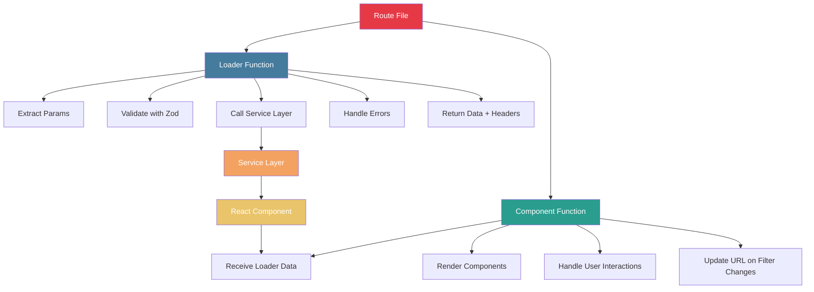

### Route File Responsibilities

#### 1. App Layout Route (`_app.tsx`)

**Loader**:

- No params to extract (always shows all regions)
- Call `RegionsService.getAllStates()`
- Set cache headers (regions data changes infrequently)
- Return region list with stats

**Component**:

- Render sidebar with region list
- Highlight active region based on URL
- Render `<Outlet />` for child routes
- Handle mobile sidebar toggle

**Meta**:

- Set page title
- Set Open Graph tags

#### 2. Index Route - Map View (`_app._index.tsx`)

**Loader**:

- Extract `state` and `district` from path params (both optional)
- Extract query params from URL search
- Validate with Zod schemas
- Validate region exists (call `RegionsService.validateRegion()`)
- Parallel fetch:
  - `MapService.getMapData(regionFilter, queryParams)`
  - `StatisticsService.getStatistics(regionFilter, queryParams)`
- Handle errors (404 for invalid region, 500 for server errors)
- Set cache headers (data changes hourly)
- Return map data + statistics

**Component**:

- Render map with markers
- Render statistics charts
- Render active filters display
- Render filter controls (form that updates URL)
- Handle map interactions (marker clicks)

**Meta**:

- Dynamic title based on region (e.g., "Befristete Wohnungen in Wien")
- Dynamic description with statistics
- Canonical URL

#### 3. Inserate Route - Listings View (`_app.inserate.tsx`)

**Loader**:

- Extract `state` and `district` from path params (both optional)
- Extract query params from URL search
- Validate with Zod schemas
- Validate region exists (call `RegionsService.validateRegion()`)
- Fetch:
  - `ListingsService.getListings(regionFilter, queryParams)`
- Handle errors (404 for invalid region, 500 for server errors)
- Set cache headers (data changes hourly)
- Return paginated listings

**Component**:

- Render listings grid
- Render pagination controls
- Render active filters display
- Render filter controls (form that updates URL)
- Handle listing card interactions

**Meta**:

- Dynamic title based on region and filters
- Dynamic description with count
- Canonical URL
- Pagination rel links (prev/next)

---

## Data Flow

### Request to Response Flow

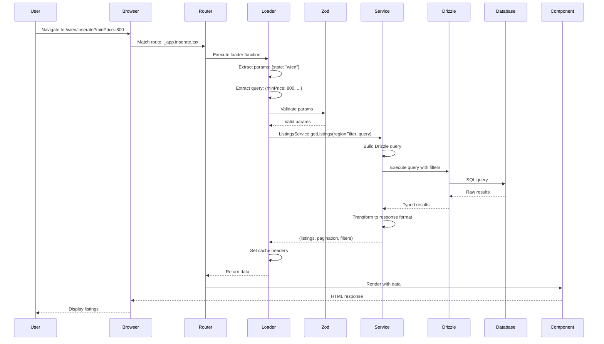

### URL Update Flow (Filter Change)

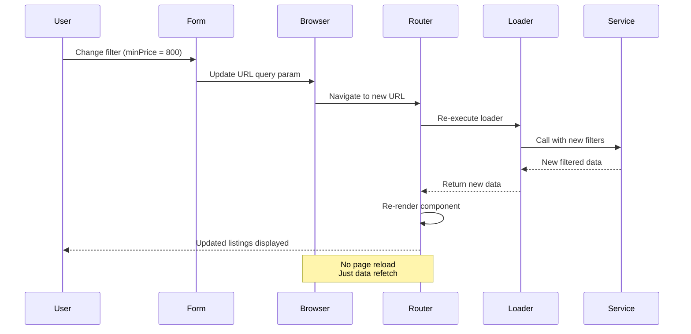

### Service Layer Internal Flow

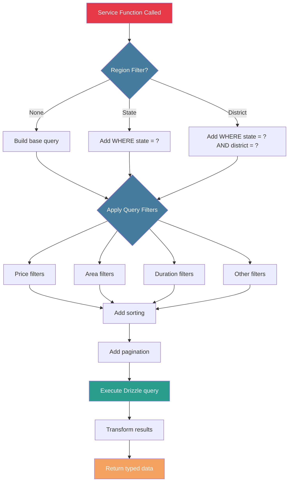

---

## Product Architecture

### User Journey - Exploring Listings

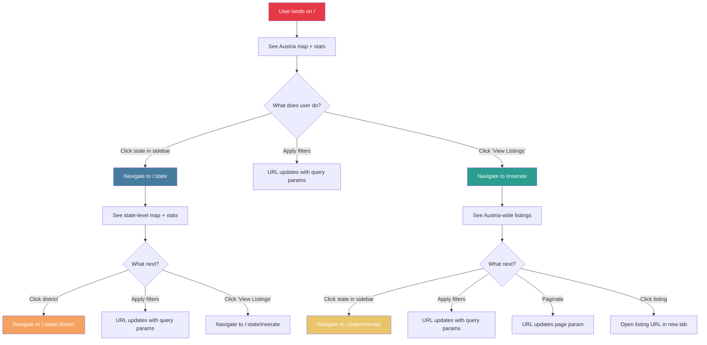

### View Switching - Map ↔ Listings

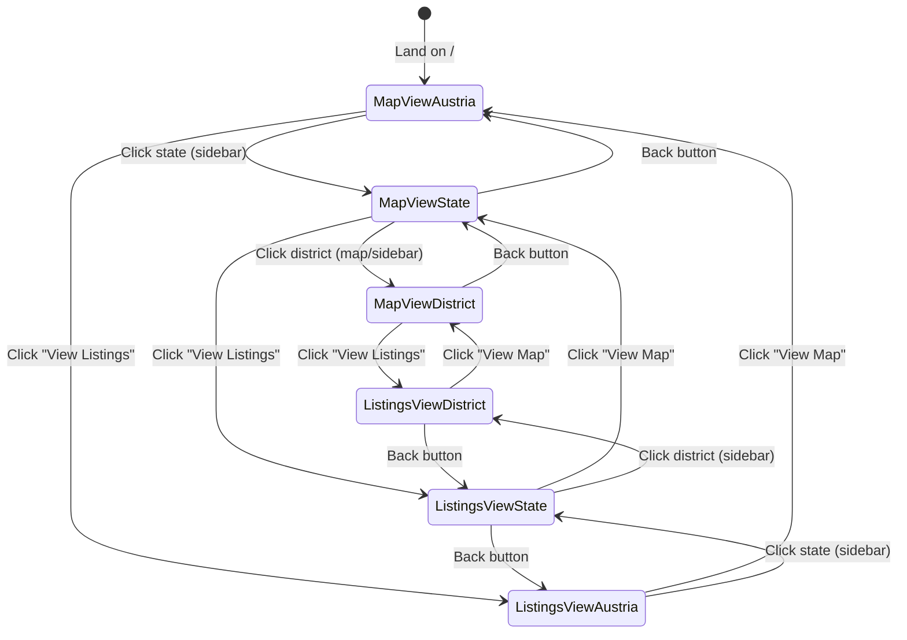

### Filter Application Flow

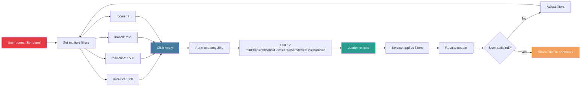

### Geographic Drill-Down

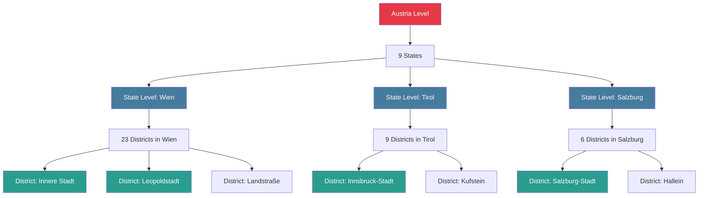

---

## Key Benefits

### Architecture Benefits

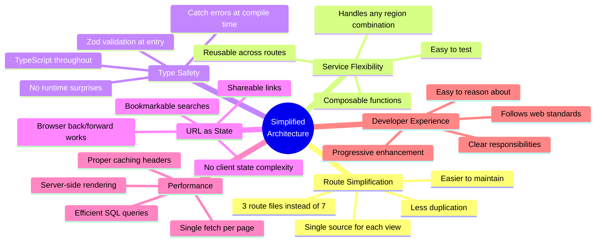

### User Benefits

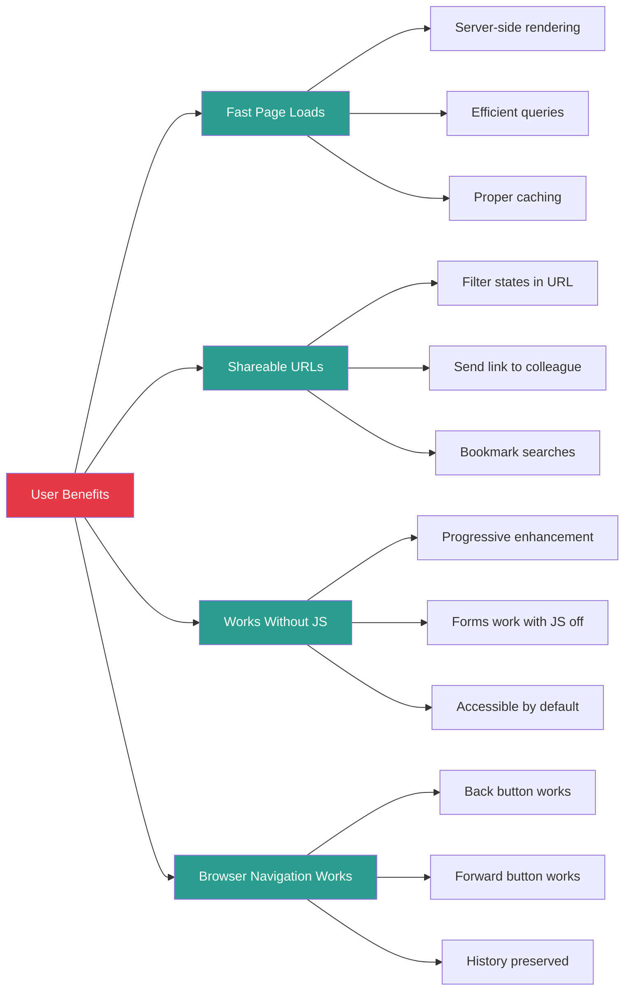

---

## Implementation Checklist

### Phase 1: Core Structure

- [ ] Create `routes.ts` configuration with 3 routes
- [ ] Implement root layout with error boundary
- [ ] Create param validation schemas in `lib/params.ts`
- [ ] Set up database client in `lib/db.server.ts`
- [ ] Define Austrian states and districts in `lib/constants.ts`

### Phase 2: Service Layer

- [ ] Implement `RegionsService` with all functions
- [ ] Implement `ListingsService` with filtering logic
- [ ] Implement `StatisticsService` with aggregations
- [ ] Implement `MapService` with bounds calculation
- [ ] Write unit tests for each service

### Phase 3: Route Loaders

- [ ] Implement app layout loader (sidebar data)
- [ ] Implement index route loader (map + statistics)
- [ ] Implement inserate route loader (listings)
- [ ] Add error handling to all loaders
- [ ] Add cache headers to all loaders

### Phase 4: Components

- [ ] Build sidebar components (region list, stats)
- [ ] Build map components (map, markers, legend)
- [ ] Build chart components (price, distribution, trends)
- [ ] Build listings components (grid, cards, pagination)
- [ ] Build filter controls (form that updates URL)

### Phase 5: Polish

- [ ] Add meta tags to all routes
- [ ] Add loading states
- [ ] Add empty states
- [ ] Add error boundaries
- [ ] Test with real data
- [ ] Optimize SQL queries
- [ ] Test on mobile devices
- [ ] Add analytics tracking

---

## Next Steps

**Ready for implementation** - This architecture provides:

- Clear route structure (3 files instead of 7)
- Flexible service layer (handles any region combination)
- Type-safe data flow (Zod + TypeScript)
- Separation of concerns (routes → services → components)
- Visual diagrams for the entire system

**Start with**: Service layer implementation, as routes and components depend on service interfaces.
