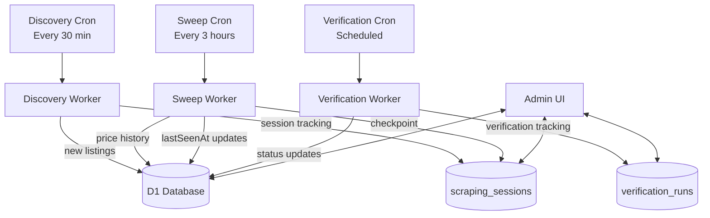
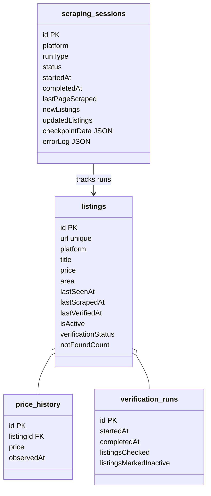
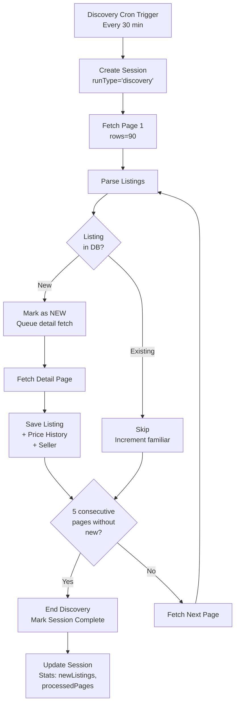
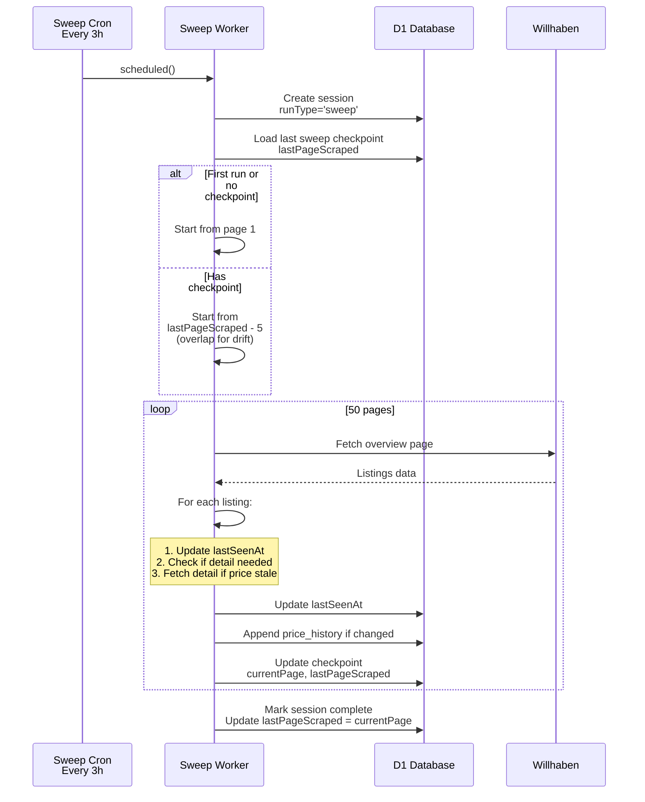
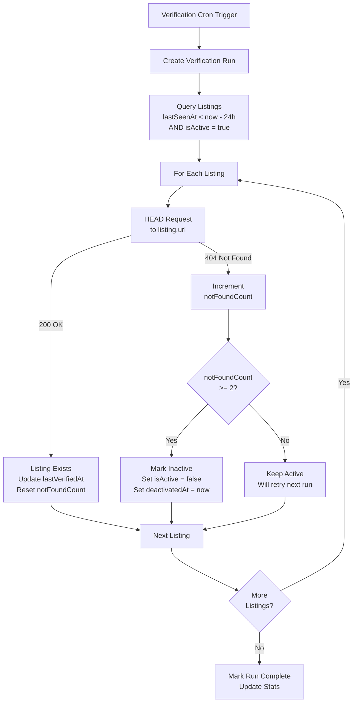
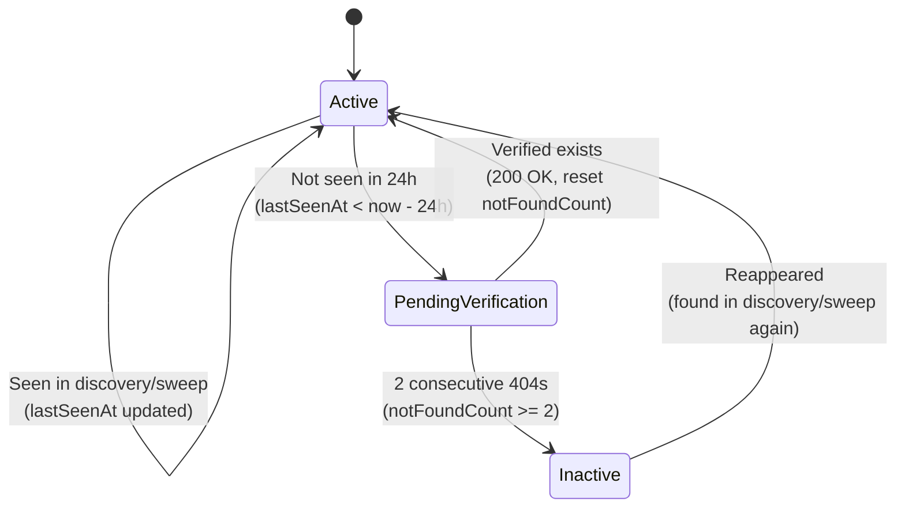
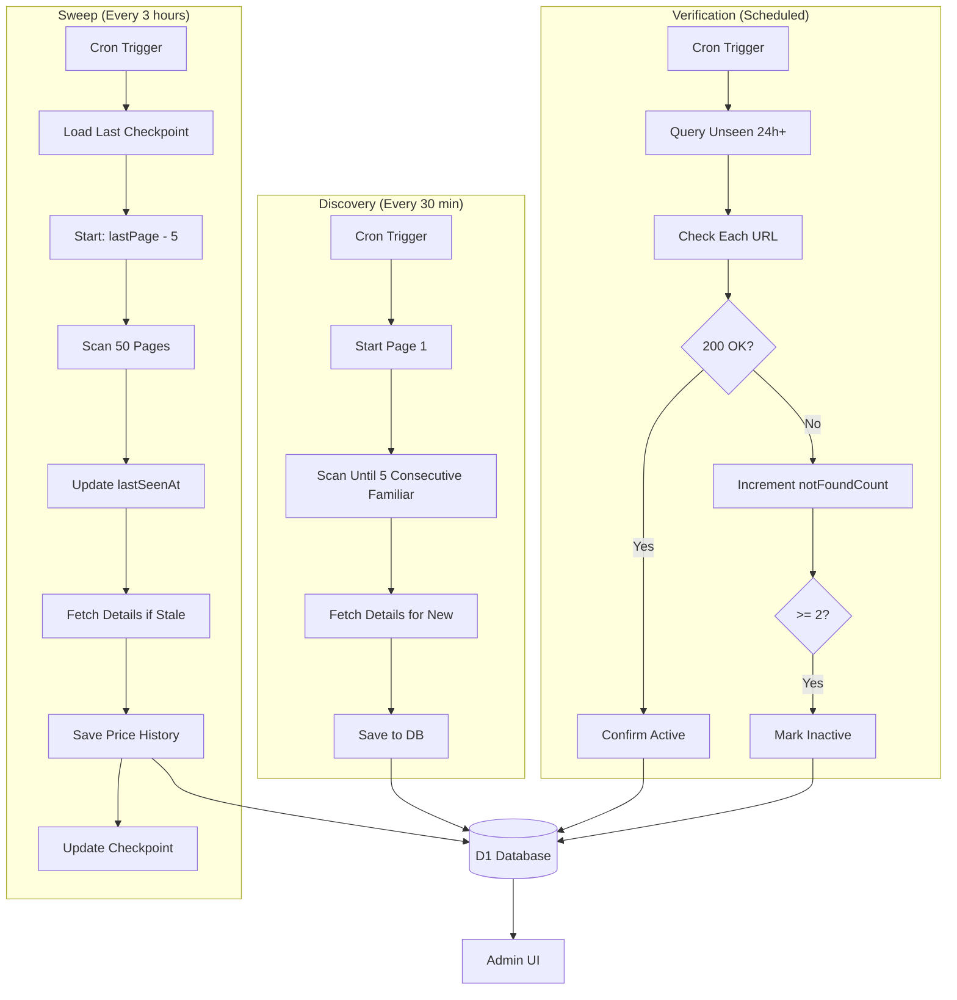

### Willhaben Scraper Rework — Cloudflare Worker PRD Overview

Last updated: 2025-11-02 (Revised: 3-Cron Architecture)

---

#### Purpose

Rebuild the Willhaben scraper to be reliable, observable and Cloudflare-native. Ensure full coverage of active listings, robust price-history tracking, and accurate deactivation detection. Deploy as a separate Cloudflare Worker with three separate cron schedules: Discovery (new listings), Sweep (price tracking), and Verification (inactive detection).

---

### Goals

- **Discovery**: Find new listings efficiently using consecutive familiar pages stopping
- **Sweep**: Track price history for existing listings with pagination drift handling
- **Verification**: Detect inactive listings not seen in last 24 hours
- Provide end-to-end observability of all runs, progress, and results
- Run via Cloudflare Scheduled Cron, writing directly to D1
- Idempotent and resumable runs; no missed listings across pages

---

### Current Implementation (Summary)

- Orchestrator: `scraper/index.ts` loads existing listings (DB → JSON fallback), runs `RentalScraper`, merges JSON, saves to DB.
- Willhaben scraper: two-phase approach in `scraper/scrapers/willhaben/index.ts`
  - Phase 1: fetch paginated overview pages; collect partial listings (urls, ids)
  - Phase 2: fetch detail pages for new listings (+ sample of existing for price tracking)
  - Concurrency limited via `p-limit(2)`; random delays + minimal UA rotation
- Database writes: Upserts into `listings`, appends to `price_history`; handles URL-based dedupe when platform ID changes
- Metadata: Records counts in returned metadata; `lastSyncedPage` is tracked but not used for resume
- Headless variant exists but unused: `scraper/scrapers/willhaben-headless/index.ts`

**Known issues today:**
- Not guaranteed to scan the full inventory; can miss listings due to continuous inserts at page 1
- No reliable deactivation detection; inactive listings not verified/marked consistently
- No unified run tracking; limited visibility into progress/errors per run
- Axios/Node APIs; not Cloudflare Worker friendly; JSON cache mixing with DB persistence

---

### Target Architecture (3-Cron System)

Run a dedicated Cloudflare Worker with D1 binding and **three separate Cron Triggers**:

1. **Discovery Cron** (every 30 minutes): Find new listings
2. **Sweep Cron** (every 3 hours): Track price history with pagination drift handling
3. **Verification Cron** (scheduled): Check inactive listings

Each cron has distinct responsibilities and independent checkpoint/resume capabilities.

**Mermaid: Architecture Overview**



**Cloudflare constraints & choices:**

- Use native `fetch` (no Node-only APIs). Replace Axios with `fetch` helpers.
- Keep runs short: chunk work by pages/time budget; resume with checkpoints
- Each cron runs independently with its own session tracking
- Consider Cloudflare Queues if volume exceeds cron compute budget; otherwise single worker with bounded concurrency is acceptable initially

---

### Data Model (D1)

Existing tables already cover our needs (from `drizzle/schema.ts`):

- `listings`: identity, location, timestamps, status flags (`isActive`, `verificationStatus`, `notFoundCount`, `firstSeenAt`, `lastSeenAt`, `lastScrapedAt`, `lastVerifiedAt`, `deactivatedAt`)
- `price_history`: append-only price observations
- `sellers`, `seller_history`: seller info and time series
- `scraping_sessions`: run tracking (status, processed pages, counters, errorLog JSON, checkpointData)
  - Add `runType` field: `'discovery' | 'sweep'` to distinguish run types
  - For sweep runs: `checkpointData` stores `{ lastPageScraped: number, sweepStartPage: number }`
- `verification_runs`, `verification_attempts`: verification sweep tracking

**Mermaid: ER view (simplified)**



---

## 1. Discovery Run (Every 30 Minutes)

### Purpose

Find **new listings** efficiently by scanning overview pages and stopping when reaching familiar territory. Fetch detail pages for all new listings discovered.

### Strategy: Consecutive Familiar Pages

**Approach:**
- Start at page 1 every run
- Scan pages sequentially with `rowsPerPage=90` (max supported)
- Stop after **5 consecutive pages with 0 new listings**
- Fetch detail pages for all new listings immediately

**Mermaid: Discovery Flow**



**Example Run:**

```
Page 1:  90 listings (15 new, 75 familiar) → fetch 15 detail pages
Page 2:  90 listings (10 new, 80 familiar) → fetch 10 detail pages
Page 3:  90 listings (5 new, 85 familiar) → fetch 5 detail pages
Page 4:  90 listings (2 new, 88 familiar) → fetch 2 detail pages
Page 5:  90 listings (0 new, 90 familiar) → consecutiveFamiliar = 1
Page 6:  90 listings (0 new, 90 familiar) → consecutiveFamiliar = 2
Page 7:  90 listings (0 new, 90 familiar) → consecutiveFamiliar = 3
Page 8:  90 listings (0 new, 90 familiar) → consecutiveFamiliar = 4
Page 9:  90 listings (0 new, 90 familiar) → consecutiveFamiliar = 5
→ STOP ✓

Result: Found 32 new listings, scanned 9 pages
```

### Request Count

**Per Run:**
- Overview pages: ~5-10 pages (typical)
- Detail pages: ~1 request per new listing (~2-50 per run)

**Per Day:**
- Overview pages: ~8 pages × 48 runs = **384 requests/day**
- Detail pages: ~32 new listings/day × 1 request = **32 requests/day**
- **Total: ~416 requests/day**

### Session Tracking

- Create `scraping_sessions` entry with `runType='discovery'`
- Track: `newListings`, `processedPages`, `lastPageScraped`, `consecutiveFamiliar`
- Store errors in `errorLog` JSON array
- No checkpoint needed (runs fast, completes quickly)

---

## 2. Sweep Run (Every 3 Hours)

### Purpose

Track **price history** for existing listings and update `lastSeenAt` timestamps. Handle pagination drift by going back 5 pages from last checkpoint.

### Strategy: Chunked Sweep with Pagination Drift Handling

**Approach:**
- Fetch **50 pages per run** (chunked approach)
- Track `lastPageScraped` in checkpoint
- Next run: Start from `lastPageScraped - 5` pages (overlap to handle drift)
- Continue until `lastPageScraped + 50` pages scanned
- For each listing seen: update `lastSeenAt`, fetch detail if price may have changed

**Mermaid: Sweep Flow**



**Pagination Drift Handling:**

```
Run 1 (00:00):
  Start: page 1
  Scans: pages 1-50
  Checkpoint: lastPageScraped = 50

Run 2 (03:00):
  Start: page 45 (50 - 5 = overlap)
  Scans: pages 45-95
  Checkpoint: lastPageScraped = 95

Run 3 (06:00):
  Start: page 90 (95 - 5 = overlap)
  Scans: pages 90-140
  Checkpoint: lastPageScraped = 140

... continues until wraps around at page 200+
```

**Why 5 pages back?**
- New listings push old listings down by ~1-2 pages per discovery run
- Overlap of 5 pages ensures we catch any listings that drifted
- Trade-off: Some duplicate work, but guarantees completeness

### Detail Fetch Strategy

For existing listings encountered in sweep:
- **Always update** `lastSeenAt = now`
- **Fetch detail page** if:
  - `lastScrapedAt IS NULL` (never fetched)
  - OR `lastScrapedAt < now - 24 hours` (stale price data)
- **Append to price_history** if price changed

**Bounded fetch:** Limit to 100 detail fetches per sweep run to prevent overload.

### Request Count

**Per Run:**
- Overview pages: 50 pages
- Detail pages: Up to 100 listings (bounded sample)

**Per Day:**
- Overview pages: 50 pages × 8 runs = **400 requests/day**
- Detail pages: ~100 × 8 runs = **800 requests/day** (max)
- **Total: ~1,200 requests/day** (max)

### Session Tracking

- Create `scraping_sessions` entry with `runType='sweep'`
- Track: `updatedListings`, `processedPages`, `lastPageScraped`
- Store checkpoint in `checkpointData`: `{ lastPageScraped: number, sweepStartPage: number }`
- Resume capability: Load checkpoint on next run to continue from last position

---

## 3. Verification Run (Scheduled)

### Purpose

Check listings that haven't been seen in the last 24 hours to detect inactive/deleted listings.

### Strategy: Time-Based Verification

**Approach:**
- Query: `listings WHERE lastSeenAt < now - 24 hours AND isActive = true`
- For each candidate: HEAD/GET request to listing URL
- Apply 2-strike rule: `notFoundCount >= 2` → mark inactive

**Mermaid: Verification Flow**



**State Transitions:**



### Request Count

**Per Run:**
- Verification requests: ~50-200 listings (depending on how many unseen)

**Per Day:**
- Depends on verification frequency (suggest: every 6 hours)
- **Total: ~200-800 requests/day**

### Session Tracking

- Create `verification_runs` entry
- Track: `listingsChecked`, `listingsConfirmedActive`, `listingsMarkedInactive`
- Create `verification_attempts` entry for each listing checked
- Store errors in `errorLog` JSON array

---

## Complete System Flow

**Mermaid: Complete Architecture**



---

## Observability & Admin

### Session Tracking

Each run creates a session record:

**Discovery Sessions:**
- `runType='discovery'`
- Metrics: `newListings`, `processedPages`, `consecutiveFamiliar`
- No checkpoint needed (runs fast)

**Sweep Sessions:**
- `runType='sweep'`
- Metrics: `updatedListings`, `processedPages`, `lastPageScraped`
- Checkpoint: `{ lastPageScraped: number, sweepStartPage: number }`

**Verification Runs:**
- Separate table: `verification_runs`
- Metrics: `listingsChecked`, `listingsMarkedInactive`

### Admin UI Requirements

**Routes:**
- `/admin/scraper/discovery` - List discovery sessions
- `/admin/scraper/sweep` - List sweep sessions with checkpoint info
- `/admin/scraper/verification` - List verification runs

**Features:**
- Filter by status (running/completed/failed)
- Drill into session: page-by-page progress, errors, checkpoint data
- Visualize sweep progress: current page, pages remaining
- Verification outcomes: listings checked, inactive counts
- Error logs: structured JSON error logs per session

---

## Cloud Deployment

### Worker Configuration

**Separate worker:** `willhaben-scraper-worker`

**`wrangler.jsonc` bindings:**
```json
{
  "name": "willhaben-scraper-worker",
  "main": "workers/willhaben/handler.ts",
  "compatibility_date": "2024-01-01",
  "d1_databases": [
    {
      "binding": "BM_DB",
      "database_name": "befristungs-monitor",
      "database_id": "..."
    }
  ],
  "triggers": {
    "crons": [
      "*/30 * * * *",  // Discovery: every 30 minutes
      "0 */3 * * *",   // Sweep: every 3 hours
      "0 */6 * * *"    // Verification: every 6 hours (adjustable)
    ]
  },
  "vars": {
    "PLATFORM": "willhaben",
    "DISCOVERY_CONSECUTIVE_FAMILIAR": "5",
    "SWEEP_PAGES_PER_RUN": "50",
    "SWEEP_OVERLAP_PAGES": "5",
    "VERIFICATION_UNSEEN_THRESHOLD_HOURS": "24"
  }
}
```

### Implementation Notes

- Use `fetch` + small helper for retries/backoff; retain user-agent rotation
- Keep per-invocation compute bounded with early checkpoints
- Upserts via Drizzle/sqlite supported in D1
- Handle cron trigger identification: `event.cron` contains the cron schedule string

---

## Risks & Considerations

### Pagination Drift

**Risk:** New listings push old listings to later pages, causing sweep to miss some.

**Mitigation:** 
- Sweep goes back 5 pages from last checkpoint (overlap)
- Discovery always starts from page 1 (catches new listings)
- Verification catches listings missed by both

### Rate Limiting

**Risk:** Willhaben rate limits (429 errors)

**Mitigation:**
- Exponential backoff on 429 errors
- Delay between requests (500-2000ms)
- User-agent rotation
- Track rate limit errors in session logs

### Worker Timeout

**Risk:** Sweep run may exceed 30-minute worker limit

**Mitigation:**
- Checkpoint after each page
- Resume from checkpoint if timeout
- Limit detail fetches per run (100 max)

### Data Consistency

**Risk:** Listing appears in multiple runs simultaneously

**Mitigation:**
- Use database transactions for upserts
- `lastSeenAt` updates are idempotent
- Price history is append-only

---

## Definitions / Defaults

### Discovery Run
- `rowsPerPage`: 90 (max supported)
- `consecutiveFamiliarPagesToStop`: 5
- `schedule`: Every 30 minutes
- `expectedRequestsPerRun`: ~8 overview + ~1-50 detail = ~10-60 requests

### Sweep Run
- `rowsPerPage`: 90 (max supported)
- `pagesPerRun`: 50
- `overlapPages`: 5 (go back 5 pages from last checkpoint)
- `maxDetailFetchesPerRun`: 100
- `detailRefreshTTL`: 24 hours
- `schedule`: Every 3 hours
- `expectedRequestsPerRun`: 50 overview + up to 100 detail = ~150 requests

### Verification Run
- `unseenThresholdHours`: 24
- `notFoundThreshold`: 2 (2 strikes = inactive)
- `schedule`: Every 6 hours (adjustable)
- `expectedRequestsPerRun`: ~50-200 requests

### Total Daily Requests

**Discovery:** ~416 requests/day
**Sweep:** ~1,200 requests/day (max)
**Verification:** ~200-800 requests/day
**Total: ~1,816-2,416 requests/day**

This is **significantly more efficient** than exhaustive scanning (~23,504 requests/day) while maintaining completeness through the three-phase approach.
